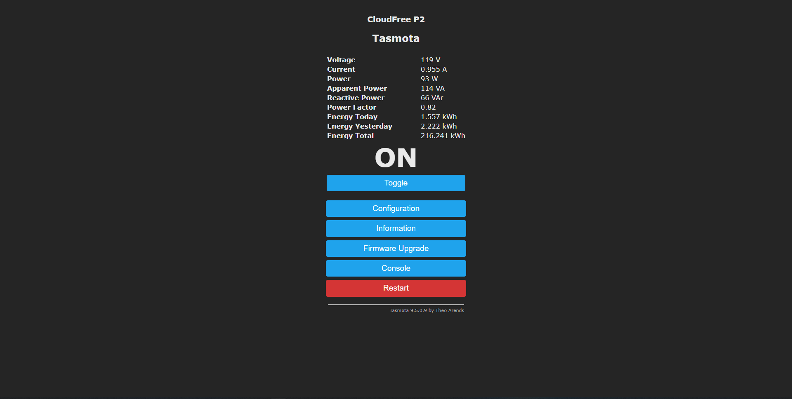
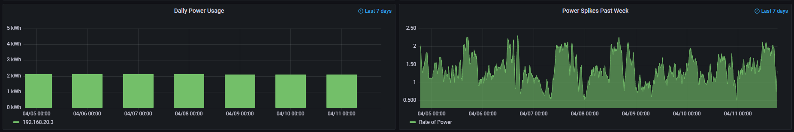

In this post, I will be discussing deploying an energy monitoring solution with Tasmota, Prometheus, and Grafana.

## Background

I personally like to have a small homelab to play around with new technologies and run certain services.  One aspect of this is that running a homelab 24/7 uses a certain amount of power, and the power bill can add up quickly depending on the amount of servers and network devices that are running.  Because of this, I wanted to find a simple way to monitor my energy consumption month to month and see if I am actually saving money running these services locally or if it would actually be cheaper in the long run to deploy them in the cloud.  For some perspective, I'm currently running three Raspberry Pi's, a Dell OptiPlex, a modem, a switch, and an old Cisco Wifi access point.  I'm hosting almost all my services on Raspberry Pi's, two of which are Pi 4B's and one which is a 2B.  Since these are quad core ARM processors with about 4GB of RAM, in order to break even, I need to be using less than a similar setup in the cloud, without taking into account any storage resources.  In DigitalOcean right now, it costs around $15 a month to run a dual core 2GB VPS, so that should be a good break even point to run the amount of services that I am currently hosting.

## The Smart Plug

The way I decided to implement this monitoring is through a smart plug flashed with the open source Tasmota firmware.  Luckily, there also exists CloudFree which is a small company that makes custom smart plugs running a pre-configured Tasmota image.  These plugs run around $13 which is fairly competitive pricing for what it offers.  Many smart plugs which used to support flashing with Tasmota over Wi-fi have become much more difficult to flash as of the past few years.  I wanted to remove the guessing game of if the smart plug I purchased could be flashed, and I enjoy the convenience that the plug is already flashed by default and also calibrated, which can be a somewhat finnicky process.  You can also flash the CloudFree smart plug with other firmware such as ESPHome as well.  You can find the CloudFree smart plug [here](https://cloudfree.shop/product/cloudfree-smart-plug-runs-tasmota/) on their website.

I also needed to consider the maximum load and draw of the smart plug before plugging my entire homelab into it.  Thankfully, the CloudFree smart plug 2 supports a max amperage of 15 amps with a load of 1800 watts which is far beyond my current needs.  Ideally, I would rather put all my devices behind a UPS anyways, but a UPS costs around $100 versus only $13 for the smart plug.

I chose to put all of my homelab behind the smart plug with all of it on a single surge protector.  The downside for this is that I can never actually switch the smart plug off without killing power to my entire homelab, but I will get metrics for all of my homelab collectively.

## Plugging in the Smart Plug

The first thing I noticed when using the smart plug is that it has a light to indicate whether the power is switched on or off for the power socket.  Also, when you turn the socket on, it stays on even if it loses power and gets unplugged, which means I won't have to press the power button on it every time I lose power.  Following the directions that come with the smart plug, I was able to set it up and get it connected to my network.  Logging into the dashboard shows the screen below.



The Tasmota dashboard shows you directly the various statistics that I was trying to get into the first place.  The typical use case is to scrape the smart plug by connecting it to a HomeAssistant instance, but I didn't want to deal with setting that up for simply monitoring power usage of a single plug.    It turns out that if you navigate to the "/m?=1" page, it simply returns the following:
```
{t}{s}Voltage{m}119 V{e}{s}Current{m}0.970 A{e}{s}Power{m}91 W{e}{s}Apparent Power{m}115 VA{e}{s}Reactive Power{m}70 VAr{e}{s}Power Factor{m}0.79{e}{s}Energy Today{m}1.565 kWh{e}{s}Energy Yesterday{m}2.222 kWh{e}{s}Energy Total{m}216.249 kWh{e}{t}ON
```

Using this, I decided to simply parse this format and receive the metrics.

## Configuring the Smart Plug

In addition, I did a few extra things with my smart plug.  One was to add simple HTTP authentication.  Now, this will obviously be plaintext across the network, but if I have someone sniffing credentials across my network, I have other issues.  The main reason I did this was to prevent someone from accidentally accessing the network and turning off the socket.  I did this more for the sake of doing it then actual security measures.

Lastly, in order for the energy today and energy yesterday metrics to work, Tasmota needs to know the time and timezone.  I did this with the following command (replacing <current epoch> with the current epoch time found [here](https://www.epochconverter.com/)):
```
time <current epoch>
TimeSTD 0, 1, 11, 1, 2, -300
TIMEDST 0, 2, 3, 1, 2, -240
TimeZone 99
Status 7
```

The rest of the commands just set the daylight savings time configurations, and shows the current time of the smart plug.  You can find more of the configuration options [here](http://douglask.fog.org/home/tasmota-time-configuration).  Additionally, you can also setup a NTP server and have it sync off of that, which is probably easier if you already have one in your homelab.

## Scraping Metrics

For pulling metrics, I was already using Prometheus for scraping different devices.  I decided to write a custom exporter to scrape and serve the Tasmota dashboard metrics via HTTP.  I also published this and wrote a Github Actions pipeline to build a Docker container for it to make deployment very simple.  You can find both here on my GitHub: [github.com/astr0n8t/tasmota-power-exporter](https://github.com/astr0n8t/tasmota-power-exporter)

Using this in conjunction with Prometheus, you can have a fairly simple way to scrape the metrics directly from Tasmota without needing HomeAssistant or any other MQTT Broker.

You can quickly run this in Docker Compose with the following:
```
  tasmota:
    image: ghcr.io/astr0n8t/tasmota-power-exporter:latest
    container_name: tasmota-power
    restart: always
    ports:
    - 8000:8000
    environment:
    - DEVICE_IP=<Tasmota IP>
    - USER=<user>
    - PASSWORD=<password>
```

The Prometheus config looks something like this with the exporter running on port 8000:
```
- job_name: "tasmota"

    # metrics_path defaults to '/metrics'
    # scheme defaults to 'http'.

    static_configs:
        - targets: ["127.0.0.1:8000"]
```

With this running, now whenever Prometheus scrapes the /metrics endpoint on port 8000, the exporter requests updated metrics from the /m?=1 endpoint on the Tasmota smart plug.

## Visualizing the Metrics

With the metrics being scraped, we can now pull those into Grafana.  The dashboard can be found in the GitHub of the exporter for those interested.




Most of these statistics and metrics deal with the monthly cost of the homelab.  I set this up a few months ago to generate plenty of data, and it seems that my monthly average is around $7-10 a month to run my homelab.  This means that I am saving money running these services on my own hardware versus in the cloud.

## Conclusion

The end result of this project is that I now have a simple way to monitor my energy usage in my homelab.  If I add a device, I can begin to see the monthly impact that has on my power bill.  One thing that this project has shown me is that my Dell Optiplex serving as my firewall can probably be replaced with a more low powered solution while still having similar network performance.  I'm also considering acquiring some thin clients to serve as virtualization hosts, but that's a post for a different day.

If you have any questions or suggestions for this project, feel free to leave an issue on the [GitHub](https://github.com/astr0n8t/tasmota-power-exporter), reach out to me on Twitter [@astr0n8t](https://twitter.com/astr0n8t), or leave a comment down below.

Thanks for reading!

