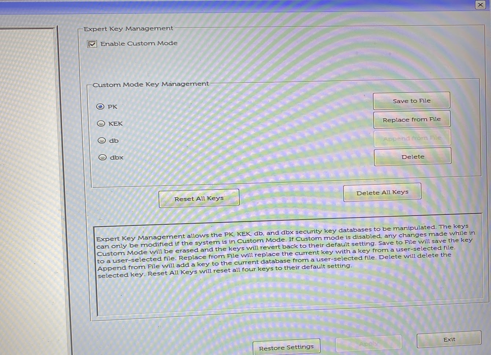

Secure boot is a feature meant to increase the security of your computer without you usually even having to worry about it.  It essentially verifies that your bootloader is actually the bootloader it says it is and makes sure the bootloader is in a list of approved bootloaders.  If you want to read more about secure boot, I recommend [this HowToGeek article](https://www.howtogeek.com/116569/htg-explains-how-windows-8s-secure-boot-feature-works-what-it-means-for-linux/) which descirbes some of what secure boot does.

#### Why Custom Keys?

By default your computer comes with a variety of Secure Boot Keys from the OEM (Original Equipment Manufacturer), which for most people is fine, but if you are extremely concerned about your computer's security or if you just want to mess around with secure boot for fun like me, putting your own keys into your computer's UEFI firmware is actually quite easy provided you are running Linux or have access to a Linux Live ISO on a USB.

The process is traditionally considered complicated as you need to use openssl and a bunch of commands to get your own keys, but I was able to use [cryptboot](https://github.com/xmikos/cryptboot) to roll custom keys on my new Arch Linux installation as well as for my Windows 10 installation on a separate drive.  The cryptboot readme will tell you that you need to have a specific partition scheme and encryption to utilize the software, but this is actually false.  Once you install the software, you can easily disregard the rest of the readme.

#### Removing OEM Keys

The first step to putting your own custom keys into your UEFI firmware is to remove the manufacturer's original keys.  You will need to boot into the UEFI BIOS to access these settings which varies from computer to computer, but mine was easily accessed by pressing the F2 key on boot.

From there locate the Security and/or Secure Boot configuration settings.  Then you will need to delete all keys.  My laptop was made by Dell who have actually added a feature where you can run in Custom mode so any changes you make are completely reversible if you decide you do not want to proceed or if you cannot get it to work.

Below is a screenshot of my UEFI firmware: 



Make sure you delete the original keys or else the process will not work.  Even selecting Audit mode will not allow the script to enroll your custom keys in the firmware.

#### Enrolling Your Keys

The last few steps are pretty simple.  Logon to the Linux distribution of your choice and open a root terminal session.  You will need to know the location of your bootloader's EFI file.

For Linux, this file can be found in the following location on the EFI partition:
```
EFI/grub/grubx64.efi
```
On Windows it can be found here:
```
EFI/Microsoft/Boot/bootmgfw.efi
```

Now you will need to execute the following commands:

This command will prompt you for a name, you can choose whatever you like as it won't actually affect the keys themselves.  By default the command places the keys in */boot/efikeys*.
```
cryptboot-efikeys create
```

This command will actually place the keys in your UEFI firmware.  If you see any errors when running this command, then you need to ensure you deleted the OEM keys.  If it fails, your keys are most likely not enrolled.
```
cryptboot-efikeys enroll
```

#### Signing Bootloaders

The very last step is to sign the bootloaders which you will use.
(Replace the path with whatever bootloader you use and repeat for multiple bootloaders i.e. Grub and Windows Boot Manager)

```
cryptboot-efikeys sign "EFI/grub/grubx64.efi"
```

#### Finishing Up

Now, you can reboot your computer and again enter the UEFI firmware to ensure that Secure Boot is enabled in Deploy mode (if your computer has that option).  If the computer fails to boot your OS after doing this, do not panic!  Simply disable Secure Boot, and your operating system will load as usual in which case you can debug what went wrong.  

You should now have a fully functional custom Secure Boot installation.  If your */boot* directory is not encrypted and on your main drive, I would recommend transferring the files within the */boot/efikeys* to either an encrypted drive or a flash drive you keep somewhere safe, or even better an encrypted flash drive.  Otherwise, an attacker could easily read your drive, grab the keys and sign their own bootloader which completely negates Secure Boot.  If you do not plan to install another operating system on the computer, you could even delete the keys completely and be fine.  The boot manager is never changed on Linux, and I do not believe it is on Windows either; and if it is, you can simply delete the keys in the UEFI firmware and create and enroll new ones again.
