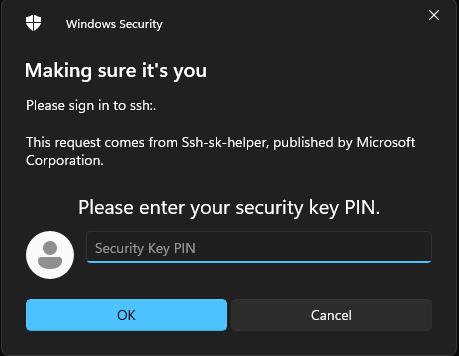

I recently acquired a hardware security key which has the ability to store SSH keys of the type ed25519-sk.  I thought this was useful, as an issue if you use multiple operating systems is always having access to your SSH keys.  Unfortunately, while I found the native Linux commands to set this up, I didn't find much support on how to do this properly on Windows or WSL.

Luckily for you, I found a way to make it work natively in Windows and also with WSL.  This works remarkably well, and Windows even stores your SSH key password in its keychain so you don't need to manually add keys to SSH Agent ever again.

## Overview

Essentially what this setup requires is a native Windows build of OpenSSH that includes support for the ed25519-sk and ecdsa-sk SSH key types.  Once this is installed, we can simply forward the connection to the Windows SSH Agent service to our Linux host on WSL.

## Step 1: Install Native OpenSSH on Windows

It's entirely possible you already have a compatible OpenSSH client.  Just open PowerShell and run the following:
```
> ssh -V
OpenSSH_for_Windows_8.9p1, LibreSSL 3.4.3
```

If you're version is higher than 8.9p1, you're all set!  Just proceed to step 2.  Otherwise continue following the instructions below.

### Remove Old OpenSSH Client

If you installed the OpenSSH client package on Windows, you should go ahead and remove that now before you proceed.  To do that quickly, run the following command:

```
Remove-WindowsCapability -Online -Name OpenSSH.Client~~~~0.0.1.0
```

Or, if you'd rather use the GUI, just see [this tutorial from Microsoft](https://learn.microsoft.com/en-us/windows-server/administration/openssh/openssh_install_firstuse).


### Install New Client

The next thing you want to do is install the beta version of OpenSSH that is on the PowerShell GitHub.  The easiest way to do that is 
```
winget install "openssh beta"
```

If you don't have winget, then simply head over to [their wiki article](https://github.com/PowerShell/Win32-OpenSSH/wiki/Install-Win32-OpenSSH) for more instructions.

### Disable and Stop SSH Server

For some reason, this package installs the SSH server and enables the service by default.  This is a bit of a security concern as you're serving a remote connection service to your PC.  

Fortunately, its pretty easy to disable this.  Just run the following from an Administrator PowerShell:

```
Stop-Service -Name sshd
Set-Service -Name sshd -StartupType Disabled
```

Or you can go into the services GUI and stop and disable the service.

### Start and Enable SSH Agent

Next, you need to make sure the SSH Agent service is running and enabled.  It should be by default, but if its not you can run the following:
```
Start-Service -Name ssh-agent
Set-Service -Name ssh-agent -StartupType Automatic
```

## Step 2: Generate SSH Keys

At this point, if you're not planning on using WSL, you're actually done.  You can go ahead and plugin your security key and generate your SSH keys now.

I used the following command to generate my keys:

Note: you may need to be in an Administrator terminal to generate the key as you're accessing the USB.  This is only needed for key generation though.
```
ssh-keygen -t ed25519-sk -O "resident" -O "verify-required" -f .\id_ed25519 -C "user@host"
```

The "resident" allows the key to fully reside on the hardware key.  Only do this if you have your U2F pin set (which you should).

The "verify-required" forces you to enter your pin if set, as well as verifying your presence on the security key.

Combining these options ensures a 2FA solution for accessing your SSH private key.  It combines something you have (hardware key) with something you know (pin).  Also, most hardware keys will lock after so many failed pin attempts so there's not much risk of an attacker brute forcing your pin, but you should still protect it none the less.

Now, simply perform the following command to register your key with the SSH Agent service:
```
ssh-add .\id_ed25519
```

Now when you need to use your SSH key, you will get a prompt like this:
<center>
</img>
</center>

Once you enter your pin, it should prompt you to tap your security key:

<center>
</img>
</center>

Once you tap your security key, you should be authenticated to whatever you were trying to use your SSH key for.

## Step 3: Setting up WSL Integration

If you're like me, you probably use WSL for pretty much everything development related on your Windows PC.  Fortunately, getting your shiny new hardware based SSH key working in WSL is pretty easy thanks to some open source projects.

### Install npiperelay

The first program you want to download is [npiperelay](https://github.com/jstarks/npiperelay).  Head over to the [releasees](https://github.com/jstarks/npiperelay/releases/tag/v0.1.0) page on GitHub and download the respective Windows binary for your computer.

Extract the npiperlay.exe file and place it somewhere on your C drive.  I placed mine in "C:\npiperelay" to keep it simple.  It helps for the next step to not have spaces in your filepath.

### Setup WSL Forwarding Script

On the WSL side, you need to install [socat](https://linux.die.net/man/1/socat).  It should be in your standard repositories so a simple `apt install socat` should suffice.

Next, place the following snippet I found from [this GitHub gist](https://gist.github.com/stuartleeks/43111bfb76b5bc48b6e15377fbc4848e) in your .bashrc or .zshrc or whatever shell you use:

Note: replace "/mnt/c/niperelay/npiperelay.exe" with the path to where you placed npiperelay in the previous step.
```
#
# Set up ssh agent forwarding to host
#

# Include this in .bashrc
# Ensure that the ssh-agent service is running on windows
# build https://github.com/jstarks/npiperelay and ensure it is in your PATH (or modify the script to specify the qualified path)

# Configure ssh forwarding
export SSH_AUTH_SOCK=$HOME/.ssh/agent.sock
# need `ps -ww` to get non-truncated command for matching
# use square brackets to generate a regex match for the process we want but that doesn't match the grep command running it!
ALREADY_RUNNING=$(ps -auxww | grep -q "[n]piperelay.exe -ei -s //./pipe/openssh-ssh-agent"; echo $?)
if [[ $ALREADY_RUNNING != "0" ]]; then
    if [[ -S $SSH_AUTH_SOCK ]]; then
        # not expecting the socket to exist as the forwarding command isn't running (http://www.tldp.org/LDP/abs/html/fto.html)
        echo "removing previous socket..."
        rm $SSH_AUTH_SOCK
    fi
    echo "Starting SSH-Agent relay..."
    # setsid to force new session to keep running
    # set socat to listen on $SSH_AUTH_SOCK and forward to npiperelay which then forwards to openssh-ssh-agent on windows
    (setsid socat UNIX-LISTEN:$SSH_AUTH_SOCK,fork EXEC:"/mnt/c/npiperelay/npiperelay.exe -ei -s //./pipe/openssh-ssh-agent",nofork &) 2>&1 > /dev/null
fi
```

Once this is done, re-open WSL and you should see the following:
```
removing previous socket...
Starting SSH-Agent relay...
```

And now when you need to use your SSH keys you should be prompted like you were on Windows.  As a bonus, this works from within VS Code dev containers as well which is actually two levels of socat deep.  

Some people have reported that this is unstable for them, but I haven't encountered any issues with it so far.

### Bonus: Setting up Git Signing with SSH Key

I also like to sign my Git commits with my SSH key, and you can totally do this with your hardware SSH key.  Simply take the public key and add the following to your gitconfig:
```
[user]
    signingkey = key::sk-ssh-ed25519@openssh.com AAAAsshpublickeybody
```

Once you do that, when you perform a `git commit` you will be prompted for your pin as demonstrated previously.

GitHub also supports verifying SSH key signatures on commits and also supports the ed25519-sk key types.

### Finishing Up

You should be all set now.  I've been running this for a few weeks now without any issues.  In the future, I expect the updated OpenSSH client to come to a Windows release which should simplify this process.  The real magic is forwarding the Windows SSH Agent to WSL to allow you to utilize the hardware security key.  Just keep in mind that your client also needs to support the key type and to have a backup hardware security key in case you lose or damage your primary key.

Enjoy your new fangled SSH key setup.

On a sad personal note, I was hoping for these keys to also be supported by iOS and Android via NFC, but as of yet, there are still no clients available that can use them.  The [blink](https://blink.sh/) project on iOS supports generating keys via webauthn, but still doesn't support using keys generated on other devices.  Hopefully in the future, they will support this functionality so that you can SSH on the go using your hardware security key.
