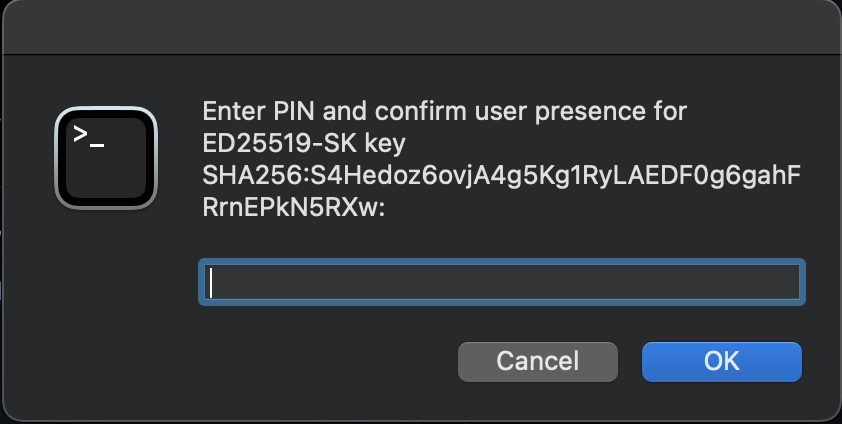

Last year, I wrote a blog post about hardware SSH keys on Windows and WSL.  This year, I am running macOS full time, and have recently dealt with similar issues, and again had difficulty finding information on this topic on the internet.

Most of the solutions I've seen involve creating custom launchd scripts or similar and seem like a bit of a hacky solution.  While this solution I am about to present is also slightly hacky, it definitely feels more streamlined to use than any other solution I've seen and even includes support for saving the pin in Apple Keychain!

So without any further fluff, lets get to it.

## The Problem

Let me first frame the problem so you understand why I am writing this post.

### macOS SSH

When you use SSH on a stock brand new install of macOS, you may think that hardware SSH keys of the type "-sk" are supported out of the box.

Running ssh -V shows the following:
```
$ /usr/bin/ssh -V
OpenSSH_9.0p1, LibreSSL 3.3.6
```

This is a relatively recent build of OpenSSH. You would think it supported these types of SSH keys, and while it should, Apple chose to build it without support for them for whatever reason.

If you try to add one to the built in ssh-agent, you might see the following:
```
$ ssh-add ~/.ssh/id_ed25519_sk
Could not add identity "/Users/astr0n8t/.ssh/id_ed25519_sk": agent refused operation
```

And from the ssh-agent logs you will see:
```
process_add_identity: parse: unknown or unsupported key type
```

So this is the sad state of OpenSSH by default on macOS.  Hardware key types are strictly not supported out of the box.

### Homebrew to the Rescue

It honestly annoyed me that the keys aren't supported out of the box, but thankfully, homebrew will help us out here.

Just do the following to get actual OpenSSH:
```
brew install openssh 
```

This will install the binaries to `/usr/local/bin` instead of `/usr/bin`.

Checking the version gives you the following:
```
$ /usr/local/bin/ssh -V
OpenSSH_9.3p1, OpenSSL 1.1.1u  30 May 2023
```

Now, lets check how hardware SSH keys work with this version.

First, disable the built in ssh-agent:
```
 launchctl disable user/$UID/com.openssh.ssh-agent
```

Second, start the OpenSSH ssh-agent:
```
$ /usr/local/bin/ssh-agent -D
```

The '-D' flag tells ssh-agent not to fork so we can see the output.  Copy the first line which sets the `SSH_AUTH_SOCK` variable and paste it into another terminal.

In that terminal, now try to add your key:
```
$ ssh-add ~/.ssh/id_ed25519_sk
Identity added: /Users/astr0n8t/.ssh/id_ed25519_sk (ssh:)
```

It works!  And now, lets try to actually use the key in some method:
```
 ssh host
sign_and_send_pubkey: signing failed for ED25519-SK "/Users/astr0n8t/.ssh/id_ed25519_sk" from agent: agent refused operation
host's password: 
```

Hmm, that's not too good.  If we look at the logs for ssh-agent, we can see why:
```
Confirm user presence for key ED25519-SK SHA256:S4Hedoz6ovjA4g5Kg1RyLAEDF0g6gahFRrnEPkN5RXw
process_sign_request2: sshkey_sign: incorrect passphrase supplied to decrypt private key
```

Essentially, ssh-agent does not know how to ask us for our pin.

## Quick Solution without ssh-agent

There is a simple solution actually, if you just want a quick and dirty way to get your key working.

Kill the ssh-agent process and try again:
```
$ ssh host
Confirm user presence for key ED25519-SK SHA256:S4Hedoz6ovjA4g5Kg1RyLAEDF0g6gahFRrnEPkN5RXw
Enter PIN for ED25519-SK key /Users/astr0n8t/.ssh/id_ed25519_sk:
Confirm user presence for key ED25519-SK SHA256:S4Hedoz6ovjA4g5Kg1RyLAEDF0g6gahFRrnEPkN5RXw
User presence confirmed
```

Hey that worked!

### Caveats

Now, this does work, and I actually was using this for many months with no issues.  

The main caveat is that you have to either specify the key with `-i` or name it one of the standard key names such as `id_ed25519_sk`.

If you are happy with that, its a simple solution that should just work with the OpenSSH homebrew.  If you want a proper ssh-agent, keep reading.

## Better Solution with ssh-agent

Recently though, I wanted to be able to use a proper ssh-agent so I could forward it over SSH and for devcontainers.

Getting this to work actually took quite a bit of learning and understanding what is happening here.

First things first, you want to actually start ssh-agent.  I do this by enabling the `ssh-agent` plugin in oh-my-zsh.  You can also do this by starting it in your profile script.

Now essentially, ssh-agent does not know two things.  The first is it does not know *how* to ask us for our pin.  The second is it does not know *where* to ask us for our pin.

### The How 

The how is actually pretty simple, and you might have already stumbled upon a similar solution on the internet.

ssh-agent relies on the `SSH_ASKPASS` variable to know what program to call to get a password from a user when it is not running within a TTY.

If you install a ssh-askpass program and set this variable, ssh-agent will now know *how* to ask you for your pin.   (This will work if you run it with `-D`, but it will prompt you in the terminal session where ssh-agent is running, not SSH itself)

### The Where

The last bit of the puzzle is telling ssh-agent where to ask.  Now, ssh-agent by default is not run with the '-D' flag.  This means that it forks, and runs in the background, without a proper TTY.

Because of this, it might not be able to send you the request for your pin because it doesn't know where to send it.

The solution is to use a graphical ssh-askpass program, and to set the `DISPLAY` environment variable.  The `DISPLAY` environment variable tells ssh-agent that it can simply launch the program specified by the `SSH-ASKPASS` variable, and the program will be displayed to the user.

If you want a quick ask-pass program, you can use this one on GitHub: https://github.com/theseal/ssh-askpass which is fairly basic.

Once you install that, and set the following environment variables:
```
export SSH_ASKPASS=/usr/local/bin/ssh-askpass
export DISPLAY=":0"
```

If you are using oh-my-zsh make sure to place these lines before your zshrc sources oh-my-zsh so ssh-agent gets called with them.

You will get the following prompt regardless of how you started ssh-agent (as long as it sees the environment variables):


So once again, this is a valid solution, and you can be satisfied with it.

## Custom Solution with ssh-agent and Keychain Support

At this point, I started to wonder, what does a ssh-askpass program actually entail.  It turns out, it just needs to print the password when called.  Nothing fancy.

I then decided that I wanted to find a better tool for the job then this ssh-askpass program.  I then stumbled accross pinentry.

### pinentry

The pinentry suite is a collection of tools that are written for gpg.  All they do is ask the user for their pin which seemed to fit since that is all I needed as well.

The source can be found here https://github.com/GPGTools/pinentry on GitHub.  It turns out that the macOS variant also supports storing the pin in Apple Keychain, and on top of that, this person wrote a version which supports using your fingerprint to unlock it as well: https://github.com/jorgelbg/pinentry-touchid.

I found this pretty cool, but more importantly, I figured these projects are better supported than the ssh-askpass one.

You can install pinentry-mac with brew:
```
brew install pinentry-mac
```

So I set off to write my own wrapper around this application, which actually wasn't too difficult.

I found this excellent blog post which helped me understand the protocol that these programs use: https://velvetcache.org/2023/03/26/a-peek-inside-pinentry/

I was then able to discern that if you simply send the "GETPIN" command to the program, it would prompt for the pin and return it.

The output returned needs to be filtered a bit, but that is simple enough with some Google and bashfu.

At this point, I had created a nice script that worked reliably, but it was lacking the ability to save the pin to keychain.

### Final Solution

Researching online gave me that there were two commands needed to enable support for Keychain, and that it had been disabled by default since it really shouldn't be enabled unless the individual wants it to be:
```
defaults write org.gpgtools.common UseKeychain -bool yes
defaults write org.gpgtools.common DisableKeychain -bool no
```

These should enable you to select to save the pin in Keychain, but I still did not see the option.

After about an hour of perusing the source code of pinentry-mac, I finally discovered why.  If I was actually using GPG with this utility, I would've seen the option, but the option relies on the KEYINFO about the key that the passphrase is requested for in order to identify the key later.

This makes sense.  The program needs a KEYID to know what to name and reference the pin by later.  Thankfully, from the previously mentioned blog post, I was able to find the command `SETKEYINFO` and `OPTION allow-external-password-cache` which would allow it to be saved in Keychain.

I had to do some string manipulation to send the SHA256 of the key with the `SETKEYINFO` command, but then it just works.

We get the following prompt now:


And selecting to save in keychain will create a new `GnuPG` item in our keychain with our key's pin.

Using that, now when we go to use our key, all we need to do is tap the key itself (assuming you have required both pin and presence when creating the resident SSH key).

The full ssh-askpass script can be found below:


<style>/* Fix some weird issue with gists and this theme */*, ::before, ::after {border-style: unset !important}</style>
<style>/* Dark mode for gists! */ .gist{font-size: 18px}.gist-meta, .gist-file, .octotree_toggle, ul.comparison-list > li.title,button.button, a.button, span.button, button.minibutton, a.minibutton,span.minibutton, .clone-url-button > .clone-url-link{background: linear-gradient(#202020, #181818) !important;border-color: #383838 !important;color: #b5b5b5 !important}.markdown-format pre, .markdown-body pre, .markdown-format .highlight pre,.markdown-body .highlight pre, body.blog pre, #facebox pre, .blob-expanded,.terminal, .copyable-terminal, #notebook .input_area, .blob-code-context,.markdown-format code, body.blog pre > code, .api pre, .api code,.CodeMirror,.highlight{background-color: #1D1F21!important;color: #C5C8C6!important}.gist .blob-code{padding: 1px 10px !important;text-align: left;background: #000;border: 0}::selection{background: #24890d;color: #fff;text-shadow: none}::-moz-selection{background: #24890d;color: #fff;text-shadow: none}.blob-num{padding: 10px 8px 9px;text-align: right;color: #6B6B6B!important;border: 0}.blob-code,.blob-code-inner{color: #C5C8C6!important}.pl-c,.pl-c span{color: #969896!important;font-style: italic!important}.pl-c1{color: #DE935F!important}.pl-cce{color: #DE935F!important}.pl-cn{color: #DE935F!important}.pl-coc{color: #DE935F!important}.pl-cos{color: #B5BD68!important}.pl-e{color: #F0C674!important}.pl-ef{color: #F0C674!important}.pl-en{color: #F0C674!important}.pl-enc{color: #DE935F!important}.pl-enf{color: #F0C674!important}.pl-enm{color: #F0C674!important}.pl-ens{color: #DE935F!important}.pl-ent{color: #B294BB!important}.pl-entc{color: #F0C674!important}.pl-enti{color: #F0C674!important;font-weight: 700!important}.pl-entm{color: #C66!important}.pl-eoa{color: #B294BB!important}.pl-eoac{color: #C66!important}.pl-eoac .pl-pde{color: #C66!important}.pl-eoai{color: #B294BB!important}.pl-eoai .pl-pde{color: #B294BB!important}.pl-eoi{color: #F0C674!important}.pl-k{color: #B294BB!important}.pl-ko{color: #B294BB!important}.pl-kolp{color: #B294BB!important}.pl-kos{color: #DE935F!important}.pl-kou{color: #DE935F!important}.pl-mai .pl-sf{color: #C66!important}.pl-mb{color: #B5BD68!important;font-weight: 700!important}.pl-mc{color: #B294BB!important}.pl-mh .pl-pdh{color: #DE935F!important}.pl-mi{color: #B294BB!important;font-style: italic!important}.pl-ml{color: #B5BD68!important}.pl-mm{color: #C66!important}.pl-mp{color: #81A2BE!important}.pl-mp1 .pl-sf{color: #81A2BE!important}.pl-mq{color: #DE935F!important}.pl-mr{color: #B294BB!important}.pl-ms{color: #B294BB!important}.pl-pdb{color: #B5BD68!important;font-weight: 700!important}.pl-pdc{color: #969896!important;font-style: italic!important}.pl-pdc1{color: #DE935F!important}.pl-pde{color: #DE935F!important}.pl-pdi{color: #B294BB!important;font-style: italic!important}.pl-pds{color: #B5BD68!important}.pl-pdv{color: #C66!important}.pl-pse{color: #DE935F!important}.pl-pse .pl-s2{color: #DE935F!important}.pl-s{color: #B294BB!important}.pl-s1{color: #B5BD68!important}.pl-s2{color: #c5c8c6!important}.pl-mp .pl-s3{color: #B294BB!important}.pl-s3{color: #81a2be!important}.pl-sc{color: #c5c8c6!important}.pl-scp{color: #DE935F!important}.pl-sf{color: #DAD085!important}.pl-smc{color: #F0C674!important}.pl-smi{color: #c5c8c6!important}.pl-smp{color: #c5c8c6!important}.pl-sok{color: #B294BB!important}.pl-sol{color: #B5BD68!important}.pl-som{color: #C66!important}.pl-sr{color: #C66!important}.pl-sra{color: #B294BB!important}.pl-src{color: #B294BB!important}.pl-sre{color: #B294BB!important}.pl-st{color: #B294BB!important}.pl-stj{color: #c5c8c6!important}.pl-stp{color: #DE935F!important}.pl-sv{color: #DE935F!important}.pl-v{color: #DE935F!important}.pl-vi{color: #DE935F!important}.pl-vo{color: #C66!important}.pl-vpf{color: #DE935F!important}.pl-mi1{color: #8F9D6A!important;background: rgba(0,64,0,.5)!important}.pl-mdht{color: #8F9D6A!important;background: rgba(0,64,0,.5)!important}.pl-md{color: #C66!important;background: rgba(64,0,0,.5)!important}.pl-mdhf{color: #C66!important;background: rgba(64,0,0,.5)!important}.pl-mdr{color: #DE935F!important;font-weight: 400!important}.pl-mdh{color: #C66!important;font-weight: 400!important}.pl-mdi{color: #C66!important;font-weight: 400!important}.pl-ib{background-color: #C66!important}.pl-id{background-color: #C66!important;color: #fff!important}.pl-ii{background-color: #C66!important;color: #fff!important}.pl-iu{background-color: #C66!important}.pl-mo{color: #c5c8c6!important}.pl-mri{color: #DE935F!important}.pl-ms1{background-color: #c5c8c6!important}.pl-va{color: #DE935F!important}.pl-vpu{color: #DE935F!important}.pl-entl{color: #c5c8c6!important}.CodeMirror-gutters{background: #222!important;border-right: 1px solid #484848!important}.CodeMirror-guttermarker{color: #fff!important}.CodeMirror-guttermarker-subtle{color: #aaa!important}.CodeMirror-linenumber{color: #aaa!important}.CodeMirror-cursor{border-left: 1px solid #fff!important}.CodeMirror-activeline-background{background: #27282E!important}.CodeMirror-matchingbracket{outline: 1px solid grey!important;color: #fff!important}.cm-keyword{color: #f9ee98!important}.cm-atom{color: #FC0!important}.cm-number{color: #ca7841!important}.cm-def{color: #8DA6CE!important}.cm-variable-2,span.cm-tag{color: #607392!important}.cm-variable-3,span.cm-def{color: #607392!important}.cm-operator{color: #cda869!important}.cm-comment{color: #777!important;font-style: italic!important;font-weight: 400!important}.cm-string{color: #8f9d6a!important}.cm-string-2{color: #bd6b18!important}.cm-meta{background-color: #141414!important;color: #f7f7f7!important}.cm-builtin{color: #cda869!important}.cm-tag{color: #997643!important}.cm-attribute{color: #d6bb6d!important}.cm-header{color: #FF6400!important}.cm-hr{color: #AEAEAE!important}.cm-link{color: #ad9361!important;font-style: italic!important;text-decoration: none!important}.cm-error{border-bottom: 1px solid red!important}#notebook .highlight table{background: #1d1f21!important;color: #c5c8c6!important}.highlight .hll{background-color: #373b41!important}.highlight .c{color: #969896!important}.highlight .err{color: #c66!important}.highlight .k{color: #b294bb!important}.highlight .l{color: #de935f!important}.highlight .h,.highlight .n{color: #c5c8c6!important}.highlight .o{color: #8abeb7!important}.highlight .p{color: #c5c8c6!important}.highlight .cm{color: #969896!important}.highlight .cp{color: #969896!important}.highlight .c1{color: #969896!important}.highlight .cs{color: #969896!important}.highlight .gd{color: #c66!important}.highlight .ge{font-style: italic!important}.highlight .gh{color: #c5c8c6!important;font-weight: 700!important}.highlight .gi{color: #b5bd68!important}.highlight .gp{color: #969896!important;font-weight: 700!important}.highlight .gs{font-weight: 700!important}.highlight .gu{color: #8abeb7!important;font-weight: 700!important}.highlight .kc{color: #b294bb!important}.highlight .kd{color: #b294bb!important}.highlight .kn{color: #8abeb7!important}.highlight .kp{color: #b294bb!important}.highlight .kr{color: #b294bb!important}.highlight .kt{color: #f0c674!important}.highlight .ld{color: #b5bd68!important}.highlight .m{color: #de935f!important}.highlight .s{color: #b5bd68!important}.highlight .na{color: #81a2be!important}.highlight .nb{color: #c5c8c6!important}.highlight .nc{color: #f0c674!important}.highlight .no{color: #c66!important}.highlight .nd{color: #8abeb7!important}.highlight .ni{color: #c5c8c6!important}.highlight .ne{color: #c66!important}.highlight .nf{color: #81a2be!important}.highlight .nl{color: #c5c8c6!important}.highlight .nn{color: #f0c674!important}.highlight .nx{color: #81a2be!important}.highlight .py{color: #c5c8c6!important}.highlight .nt{color: #8abeb7!important}.highlight .nv{color: #c66!important}.highlight .ow{color: #8abeb7!important}.highlight .w{color: #c5c8c6!important}.highlight .mf{color: #de935f!important}.highlight .mh{color: #de935f!important}.highlight .mi{color: #de935f!important}.highlight .mo{color: #de935f!important}.highlight .sb{color: #b5bd68!important}.highlight .sc{color: #c5c8c6!important}.highlight .sd{color: #969896!important}.highlight .s2{color: #b5bd68!important}.highlight .se{color: #de935f!important}.highlight .sh{color: #b5bd68!important}.highlight .si{color: #de935f!important}.highlight .sx{color: #b5bd68!important}.highlight .sr{color: #b5bd68!important}.highlight .s1{color: #b5bd68!important}.highlight .ss{color: #b5bd68!important}.highlight .bp{color: #c5c8c6!important}.highlight .vc{color: #c66!important}.highlight .vg{color: #c66!important}.highlight .vi{color: #c66!important}.highlight .il{color: #de935f!important}</style>

Simply save this somewhere, make it executable, and set the `SSH_ASKPASS` variable to point to it.

And a bonus, you can edit and customize this script to your heart's content.

Enjoy, and feel free to leave a comment or suggestion on how to improve the script!
