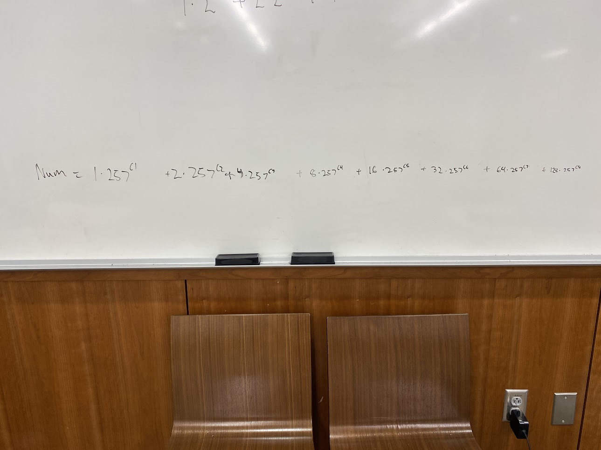
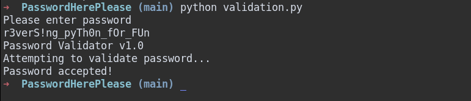

If you look at the timestamps for my submissions during this CTF, you will see that between 12:50 and 7:30, there were no submissions.
That is becasue for those six and a half hours I was working on this problem, particularly the last part.
Also, I lost my notes for this problem, but never fear, I challenged myself to solve it again to do this writeup.

If you do not have the challenge, you can find it [here on my GitHub](https://github.com/astr0n8t/MetaCTF2020/tree/main/PasswordHerePlease).

One thing to note is that at the beginning the convert to base 257 hint was not given.  That was given around 5PM.

## First things first

The first thing is that the string should be 24 characters long as is noted by this line:
```
if(len(password[::-2]) != 12 or len(password[17:]) != 7)
```

The "password\[::-2\]" means half of the string and the "password\[17:\]) != 7" means the last seven characters.

So the Python program can be split into three different parts, each taking one third of the input string.

## The First Third

This is the first part of the password checker:

```
pwlen = len(password)
chunk1 = 'key'.join([chr(0x98 - ord(password[c]))
                          for c in range(0, int(pwlen / 3))])
if "".join([c for c in chunk1[::4]]) != '&e"3&Ew*':
    print("You call that the password? HA!")
    return False
```

The chunk1 variable is where you want to take note, it is simply subtracting all of the ascii codes of the string from 98 in hex which is 152 in decimal.

And its comparing to the string '&e"3&Ew*'.

We can create a quick formula using algebra to get the original characters:
>OG_CHAR = 152 - CONV_CHAR

In decimal the string is: 
>38 101 34 51 38 69 119 42

subtracting all of these we get: 
>114 51 118 101 114 83 33 110 

which equates to this in ascii:
>r3verS!n

So now we have one third of the final flag.

## Ring around the for loop

So now onto the second part:
```
chunk2 = [ord(c) - 0x1F if ord(c) > 0x60
              else (ord(c) + 0x1F if ord(c) > 0x40 else ord(c))
              for c in password[int(pwlen / 3) : int(2 * pwlen / 3)]]
ring = [54, -45, 9, 25, -42, -25, 31, -79]
for i in range(0, len(chunk2)):
    if(0 if i == len(chunk2) - 1 else chunk2[i + 1]) != chunk2[i] + ring[i]:
        print("You cracked the passwo-- just kidding, try again! " + str(i))
        return False
```

### The chonky second array

Let's start with the chunk2 instruction.  One thing to note here is that when you do a one line if or for statement, python is actually working backwards which is why it can be somewhat hard to understand.

```
chunk2 = [ord(c) - 0x1F if ord(c) > 0x60 else (ord(c) + 0x1F if ord(c) > 0x40 else ord(c)) for c in password[int(pwlen / 3) : int(2 * pwlen / 3)]]
```

THe first thing to note is that its looping over every character in the string from 9 to 16 inclusive.
Next, its checking if the character code is greater than 60 in hex or 96 in decimal.
If it is, it subtracts 1F hex (31 decimal) from the character, and we finish.
Otherwise, it checks if the character is greater than 40 hex (64 decimal),
if it is then it adds 1F hex (31 decimal) to the character, and otherwise it does nothing to the character.

Also note that this statement is contained in brackets so the chunk2 is now an array of ascii codes in a numeric format.

Here's an easier view I made (I didn't run this code so hopefully it's correct):

```
chunk2 = []
for c in password[8:16]:
  if ord(c) > 96:
    chunk2.append(ord(c) - 31)
  elif ord(c) > 60:
    chunk2.append(ord(c) + 31)
  else:
    chunk2.append(ord(c))
```

### One ring to rule them all

Now for the ring:

```
ring = [54, -45, 9, 25, -42, -25, 31, -79]
for i in range(0, len(chunk2)):
    if(0 if i == len(chunk2) - 1 else chunk2[i + 1]) != chunk2[i] + ring[i]:
        print("You cracked the passwo-- just kidding, try again! " + str(i))
        return False
```

This is iterating over all eight values in the chunk2 array and checking whether the next number is equal to the current number plus a certain value in the ring array.

So let's leverage this to determine what the current value is:
> CURRENT_VALUE = NEXT_VALUE - CURRENT_RING

But how does this help us? The trick here is that it does not check the last value in the ring against anything.  But each value is equal to the next value subtracted from the current ring...  There is no next value, or the next value is actually 0.

Plugging into our formula:

>CURRENT_VALUE = 0 - (-79) = 79

So the last value in the array is 79.  From there we can work backwards to determine the rest.

```
p8 = 79
p7 = 79  -   31    = 48
p6 = 48  - (-25)   = 73
p5 = 73  - (-42)   = 115
p4 = 115 -   25    = 90
p3 = 90  -   9     = 81
p2 = 81  - (-45)   = 126
p1 = 126 -   54    = 72
```

### Putting it together

Okay cool, now we have the values, right? Not quite, now we need to undo the shifting that was done in the chunk2 instruction.

So we need some math again:

Anything that was greater than 96 will never be less than 65
> 97 - 31 = 66

> 127 - 31 = 96

And anything that wasn't greater than 96 but was greater than 60 will never be greater than 127 or less than 91
> 96 + 31 = 127

> 60 + 31 = 91

Well, of everything we have, everything is less than 127 so that does not help us.  Only one thing is less than 66, 48 so we at least know that that is indeed 48.

But we do know that the ascii table has a max of 127, so 115 and 126 could not have been greater than 96 so they are 84 and 95 respectively.

73, 72, 81, 79, and 90 are all less than 91 so they must have been greater than 96 before the shift so they are 104, 103, 112, 100, and 121 respectively. 

So we have the following conversions:
```
72  + 31 = 103
126 - 31 = 95
81  + 31 = 112
90  + 31 = 121
115 - 31 = 84
73  + 31 = 104
48 +-  0 = 48
79  + 31 = 110

103 95 112 121 84 104 48 110
```

So now putting these values into a converter we get:
> g_pyTh0n

So adding that with the first third we get:
> r3verS!ng_pyTh0n

Cool, on to the final step.

## Sliding into 257th base

This was by far the hardest step for me.  I had everything, I understood the code perfectly, but I could not figure out the answer to save my life.  But at 5:09 PM, the admins sent out a hint to try converting the long number into base 257, which in theory I realized should work.  Now, it took me another two and a half hours to solve this, but that is because I tried to write a script to do a change of base.  The lesson here is look for libraries to do random things you need to instead of re-inventing the wheel.

Anyways enough story time, let's finish this thing.

This is the final third of the problem:
```
chunk3 = password[int(2 * pwlen / 3):]
code = 0xaace63feba9e1c71ef460e6dbf1b1fbabfd7e2e35401440ac57e93bd9ba41c4fbd5d437b1dfab11fe7a1c6c2035982a71765fc9a7b32ccef695dffb71babe15733f5bb29f76aae5f80fff
for i in range(0, len(chunk3)):
    code -= (257 ** (ord(chunk3[i]) - 0x28)) * (1 << i)

if code == 0:
    print("Password accepted!")
    return True
```

So there is a lot going on here, and also what is the "\<\<" operator?  So many questions, so little time.

Well the good news is that google is your friend.  The "\<\<" operator is a left bit shift, something you've probably never used in Python.
The "\*\*" operator is just raising to the power, in case you were wondering.

### Order of operations

So let's start with the inner parentheses.

This is simply subtracting the ascii codes of all the characters by hex 28 (decimal 40).

Next, we are raising 257 to the power of whatever that value is.

Lastly, we are multiplying that by 1 shifted by whatever value i is.
That value seems vague, but let's throw some logic at it.  The shift operator is only used on binary numbers so Python will assume what is in that set of parentheses is in binary and will then convert it to decimal.  In binary, the existence of a 1 means we multiply it by two raised to the power of the place of that value.  So this entire operation can be thought of as 2 to the power of i which will be 1, 2, 4, 8, 16, 32, 64, and 128 depending on the value of i.

### The numbers, what do they mean?

So all of these values are being subtracted from code, that obnoxiously large hex number.  And then at the end, we check if that number equals zero.  So we can surmise that all of our values added together equal that number.

Now at this point, I found it useful to actually write out this equation, which oddly enough I have a photo of despite not having my original notes. (Please excuse my inconsistent spacing)



So if you notice, I denote the exponents as c and then a number.  These exponents are our characters, and we need to find them.
But how?  This is the question I contemplated for literally hours, until that hint was added to the problem.

### Base 257

If we convert this number to base 257, it will have the numbers 1, 2, 4, 16, 32, 64, and 128 at different places in the number.
Why you ask?  Because this is essentially a base 257 expansion of the number.  We do a similar thing when we write a decimal or binary expansion of a number.
Fun fact: I at one point did mention to my teammate that this reminded me of a decimal expansion, but I didn't think to use base 257.

So the question became, how do I convert to base 257?  Well, that took me an hour and a half to figure out actually.
See the issue was that I was trying to do it with online websites, and then I tried to do it with a Python script I wrote based on a StackOverFlow post.  I'm still not entirely sure why my Python script didn't work, but it's all okay because I stumbled accross a Python library to do it for me.

[This Python library](https://pypi.org/project/baseconvert/) is extremely useful to solve this. This nifty library will convert any number to any base and return the answer in a tuple.

You can install it with 
```
pip install baseconvert
```

Great, now I can write a quick script to display the number in base 257 and the place values of each number that is not 0:
```
from baseconvert import base

code = 0xaace63feba9e1c71ef460e6dbf1b1fbabfd7e2e35401440ac57e93bd9ba41c4fbd5d437b1dfab11fe7a1c6c2035982a71765fc9a7b32ccef695dffb71babe15733f5bb29f76aae5f80fff

a = base(code, 10, 257)

for x in range(len(a)):
    if a[x] != 0:
        print(len(a)- x -1, a[x])
```

Executing this gives us the following output:
```
74 8
70 128
62 2
55 17
45 64
39 4
30 32
```

Sweet, now we have our exponenets/characters.

### The last step

The final step is to simply put these in order and add back 40 to shift them to their correct places: (you could even make the python script do this pretty easily)

```
1   55 + 40 = 95
2   62 + 40 = 102
4   39 + 40 = 79
8   74 + 40 = 114
16  55 + 40 = 95
32  30 + 40 = 70
64  45 + 40 = 85
128 70 + 40 = 110

95 102 79 104 95 70 85 110
```

Let's throw this into a decimal to ascii converter real quick:
> _fOr_FUn

## Fin

Okay, putting it all together:

> MetaCTF{r3verS!ng_pyTh0n_fOr_FUn}

Ironically, it's so fun, that I'm doing it twice.

Let's run this through the python program real quick to double check:



Amazing!  (Note: I had to put my input into quotes on Kali for some reason for it to work.)

This was honestly my favorite challenge in the CTF just because it was so difficult but still solveable in a creative and unique way.
Thanks for the MetaCTF team for an outstanding CTF, and I can't wait to do it again next year!
