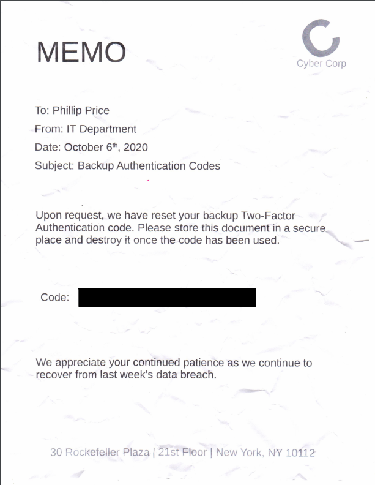
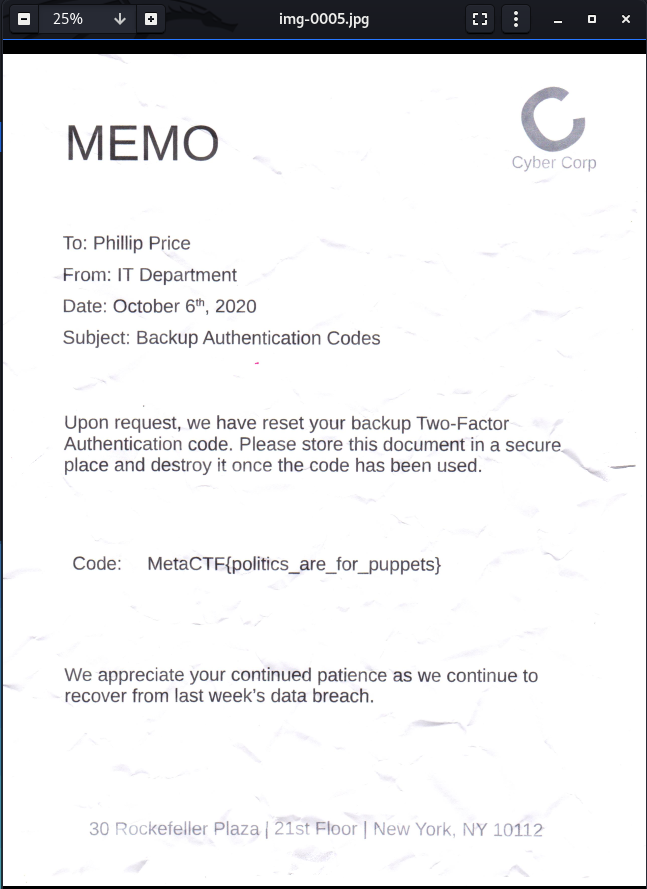

This will be a short but sweet writeup.  You can find a backup of the challenge [here on my GitHub](https://github.com/astr0n8t/MetaCTF2020/tree/main/REDACTED) in case you don't have access to it.

The challenge is simply to extract some data from a PDF file.

When you open the PDF you are presented with this:



Knowing this, it looked like there is just an image or drawing over what we want to see, so I did some research to find a suitable program to disassemble the PDF.

I stumbled upon mutools which I installed in Kali:
```
pt install mupdf-tools
```

While the tutorial I was following had some complicated steps to get what I was looking for, I simply gave
```
mutool extract cybercorp_memo.pdf
```
This gave me the following image:



And the follwing flag:
>MetaCTF{politics_are_for_puppets}

And that's it!  Just knowing the right tool for the job makes it pretty easy.
