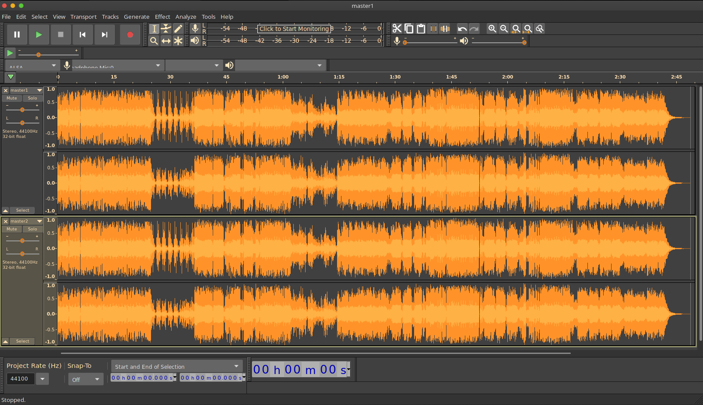
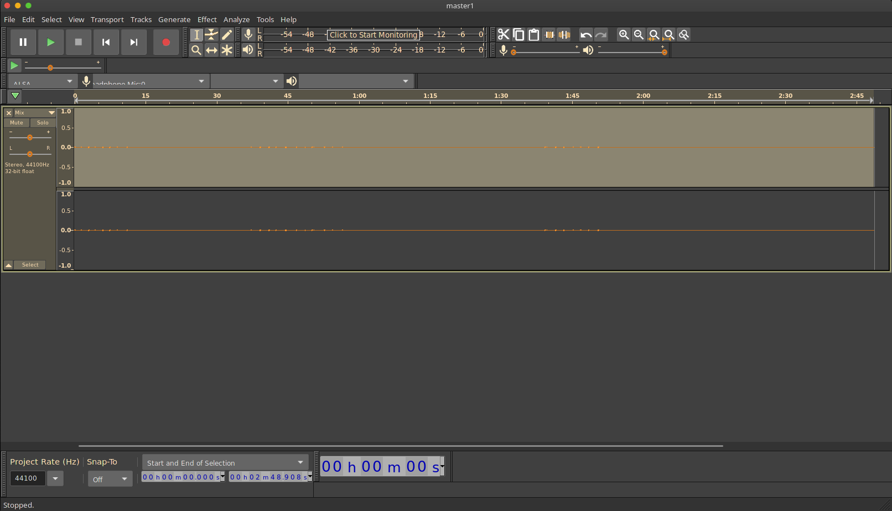

This challenge was interesting.  It was essentially a steganography challenge with audio which made it unique in this CTF as there were only a few steg challenges.

The challenge is [here on my github](https://github.com/astr0n8t/MetaCTF2020/tree/main/Watermarked) in case you do not have access to it.

The first thing to do is to download the two files and open them in audacity.

The next thing I did was reasearch until I stumbled accross [this paper](https://embeddedsw.net/doc/Openpuff_paper_Watermarks_an_in_depth_discussion.pdf) (look at page 7) detailing different watermark formats.

So going off of that, select all of one track then go to Effects and click on Invert.

Lastly, select all of the tracks and do a mixdown to one track to get the answer (Tracks>Mix>Mix and Render).

Then just listen to the audio for it to tell you the flag!
>MetaCTF{p4r7ing_7h3_w4v3z}
