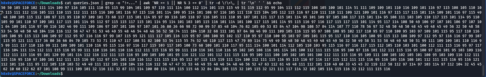
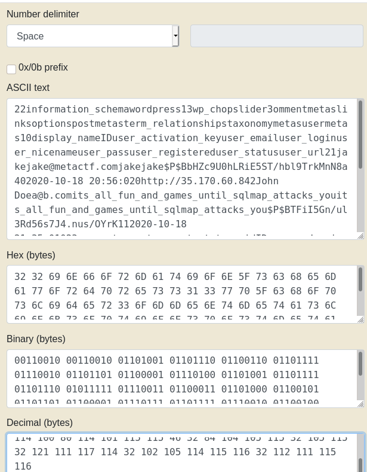

You can find this challenge [here on my Github](https://github.com/astr0n8t/MetaCTF2020/tree/main/WhenSqlmapsAttack) if you don't have it.

This challenge was a pain and a half to solve.  Apparently, the pcap file is from a Time-Based SQL attack, which you can read more about [here](https://www.sqlinjection.net/time-based/) in this article by sqlinjection.net.  When I solved this, I did not know this and literally went off of just the pcap file and trying to understand them.  Because of this, I solved it more by luck than anything.

A good thing to note is that the hint for this challenge is to look at what is changing each request, and honestly, I ended up doing just that.

The first thing I did was open the file in wireshark, and after parsing through the requests manually, I actually exported all of the packet captures matching the source IP of the attacker as a JSON file. 

With the JSON file open in vim, I was going query by query trying to figure out what was happening by searching for "http.file_data" .  I eventually realized that it was usually the same query but with a different number on the end.  Below you can find one of the queries inside of the script that called it:
```
chopslider = $('.chopslider_id_1111111111 AND (SELECT 9747 FROM (SELECT(SLEEP(1-(IF(ORD(MID((SELECT IFNULL(CAST(user_pass AS NCHAR),0x20) FROM wordpress.wp_users ORDER BY ID LIMIT 0,1),7,1))>88,0,1)))))TSGM)')\n\t\twindow.chopslider1111111111 AND (SELECT 9747 FROM (SELECT(SLEEP(1-(IF(ORD(MID((SELECT IFNULL(CAST(user_pass AS NCHAR),0x20) FROM wordpress.wp_users ORDER BY ID LIMIT 0,1),7,1))>88
```

On every query the end of the query ">88" would change to something else, eventually changing to !=NUM where NUM is a number of two to three digits.
I randomly decided to start taking the numbers from the != and putting it into a decimal to ascii converter, query by query.  While this took some time, I eventually started to see that it was spelling out some things; most notably jake@metactf.com.

At some point, instead of manually doing this, I decided to use regex to parse this out, using the following command:
```
cat queries.json | grep -o "!=..."
```

This gives you all of the numbers, but the data is a little messy, and every three numbers are the same.  So I had to use some more commands to clean it up a bit:
To select only the third line:
```
awk 'NR == 1 || NR % 3 == 0'
```

To remove the != and any commas:
```
tr -d \!\=\,
```

And then I was able to copy all of them into an online decimal to ascii converter.  For fun, here is how to remove the newlines to make it easier to copy as well:
```
| tr '\n' ' ' && echo
```

Putting it all together:
```
cat queries.json | grep -o "!=..." | awk 'NR == 1 || NR % 3 == 0' | tr -d \!\=\, | tr '\n' ' ' && echo
```


Lastly, copy this into a ascii to decimal converter to get the results:



If you notice the underscores, you can see the flag:
```
MetaCTF{its_all_fun_and_games_until_sqlmap_attacks_you}
```

This challenge seemed weird at the time, but makes a lot more sense when you learn about time based attacks.  I had fun solving this one since it was a really janky way to solve it but still worked as far as I can tell.
