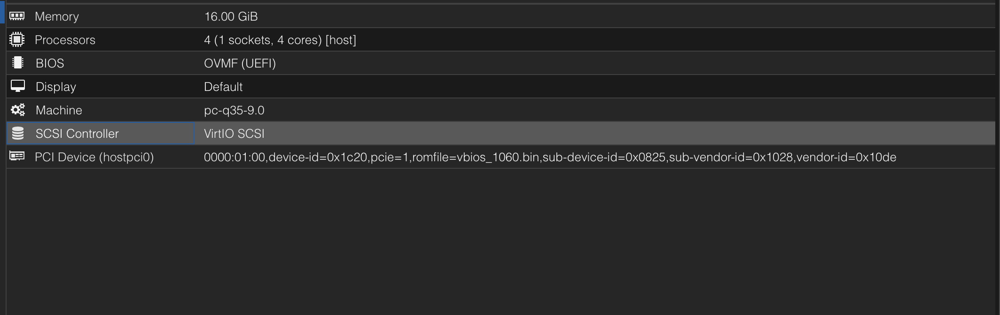
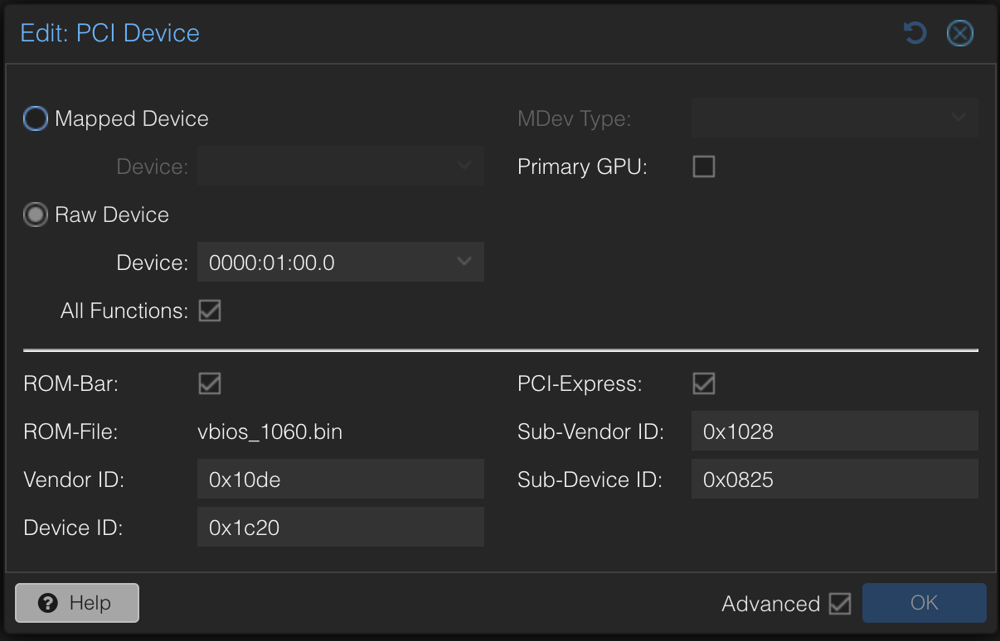
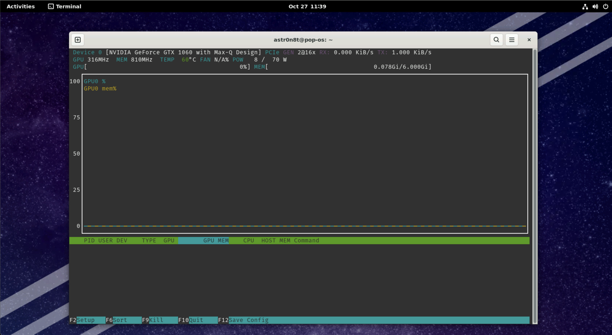

# Motivation

The first question when beginning something is asking yourself why?  In this case, the reason was more curiosity than anything specific.  I run Proxmox on my old gaming laptop and only really use it for random experiments.  It has quite a bit of power for that and seems to work great.  Given that it is a gaming laptop, it has a dedicated graphics card inside, and I wondered if I would be able to pass it through to a VM to be able to do things like run Windows and play games or run Linux and try some machine learning with CUDA.  

I had never done this before, mainly because everywhere you look on the internet says it is impossible.  And while I found out it is not impossible, it definitely was not easy to figure out and some of these techniques are very recent in their publication.

# Before you Start

Things to know is that this may or may not work for you.  If you have the exact same laptop as me: Dell G5 15 5587 with Nvidia GTX 1060 6GB then it probably will.  Otherwise your mileage may vary but this technique seems universal from what I gathered during research.

Certain Optimus laptops are either muxed or muxless.  What does that mean?  Basically it means that on some laptops the dedicated Nvidia GPU is wired directly to the HDMI port on the laptop whereas on others it is not.  That doesn't mean all hope is lost though as there is a way to get the integrated Intel graphics working in addition as well, but it is a lot more effort that I did not end up needing to do.  I will leave the resources I used at the end of the post for anyone who is curious and if enough people are interested I can also make a post on that.

# Getting Started

## Obtaining the vBIOS

So the first thing you will need when starting is a copy of the vBIOS of your GPU.  For me, most of the ways to do this online did not work.  I would get a vague `Input/Output Error` when trying to perform it in Linux.

The way I was able to do it was weird but works flawlessly and I discovered it [here on an old forum post](https://web.archive.org/web/20230628195028/https://forums.laptopvideo2go.com/topic/32103-how-to-grab-a-notebooks-vbios-that-is-not-supported-by-nvflash/)

Essentially, for some reason, the Nvidia drivers place a hexdump of vBIOS of the card in a registry key in Windows.

First thing you want to do is boot into Windows.  Once in Windows, make sure you have the Nvidia drivers installed.

With that done, next thing you want to do is try and save a specific registry file that should look like this:
```
HKEY_LOCAL_MACHINE\SYSTEM\CurrentControlSet\Control\Class\{4d36e968-e325-11ce-bfc1-08002be10318}\0002\Session
```

I had to switch out the `0002` to `0001` but whichever number has the `Session` key should be what you want.  Export that key and save it somewhere.

### Extracting from the Registry Key Method 1

The easiest way to do this next step is to use this command that I made for macOS (but I think should work on Linux as well?):
```sh
echo -e -n "\x$(iconv -f UTF-16 -t US-ASCII vbios.reg | tr -d '\n' | tr -d '\r' | awk -F: '{print $2}' | awk -F'"' '{print $1}' | tr -d ' ' | tr -d '\\' | sed 's/,/\\x/g')" > vbios.bin
```

You'll know you did it right because when you run the `file` command it should report something like:
```sh
root@proxmox:/# file vbios.bin
vbios.bin: BIOS (ia32) ROM Ext. IBM comp. Video "IBM VGA Compatible\001" (211*512) instruction 0xeb4b3734; at 0x170 PCI NVIDIA device=0x1c20 PRIOR, ProgIF=3, at 0x40 VPD, revision 3, code revision 0x3, last ROM, 3rd reserved 0x8000
```

And the file size for me was `262144` bytes.

### Extracting from the Registry Key Method 2

If for some reason that doesn't work or you want to do it on Windows, the steps are pretty much as follows:

1. Open the .reg file in Notepad++
2. Delete these lines:
```
"vbiosSource"=hex:06
"RmRCPrevDriverVersion"=hex:33,38,38,2e,31,36,00
"RmRCPrevDriverBranch"=hex:72,33,38,38,5f,31,30,2d,35,00
"RmRCPrevDriverChangelist"=hex:7c,d8,5f,01
"RmRCPrevDriverLoadCount"=hex:01,00,00,00
```
3. Replace all commas with spaces
4. Replace all backslashes with nothing
5. Select everything
6. Open the [HxD Hex Editor](https://mh-nexus.de/en/hxd/) and create a new file
6. Paste it into the hex editor
7. Save it as vbios.bin

Now the same things should apply from before. I did this second method at first before creating the one liner out of curiosity and spite because I'd rather have a quick way to do things from the CLI than use a GUI.

# Proxmox Configuration

Okay, now we have the first file we need, which is also the most important.

## Proxmox Host Settings

First things first, we need to follow the normal [Proxmox PCI-E Passthrough Guide](https://pve.proxmox.com/wiki/PCI(e)_Passthrough).

### Getting Hardware IDs

So let's grab some hardware IDs.

Run the `lspci` command like so and take note of your Nvidia GPU:
```sh
root@proxmox:~# lspci -nnk
...
01:00.0 VGA compatible controller [0300]: NVIDIA Corporation GP106M [GeForce GTX 1060 Mobile] [10de:1c20] (rev a1)
	Subsystem: Dell GP106M [GeForce GTX 1060 Mobile] [1028:0825]
	Kernel driver in use: vfio-pci
	Kernel modules: nvidiafb, nouveau
01:00.1 Audio device [0403]: NVIDIA Corporation GP106 High Definition Audio Controller [10de:10f1] (rev a1)
	Kernel driver in use: vfio-pci
	Kernel modules: snd_hda_intel
...
```

### Drivers

Ideally you have not installed the nvidia drivers.  If you have, I highly recommend uninstalling them now before going any futher:
```sh
sudo apt remove 'nvidia*' bumblebee-nvidia primus-nvidia primus-vk-nvidia
```

If you choose not to do this, and want to simply blacklist the drivers, just know that nvidia also has this weird systemd service called `nvidia-persistenced` which will simply re-load the kernel module at boot so also disable that if you are leaving the original drivers installed.

And reboot your host to make sure it works.

### Kernel Parameters

The first thing you need to do is enable IOMMU, so for an Intel CPU add this to the `GRUB_CMDLINE_LINUX_DEFAULT` line in `/etc/default/grub` :
```
intel_iommu=on
```

And also add this line regardless of processor type in case you want better performance:
```
iommu=pt
```

Now run this to update your GRUB configuration:
```sh
update-grub2
```

### Kernel Modules

Next you need the VFIO kernel modules, so add these lines to `/etc/modules` :
```
 vfio
 vfio_iommu_type1
 vfio_pci
 vfio_virqfd #not needed if on kernel 6.2 or newer
```

And then update your initramfs like so:
```
update-initramfs -u -k all
```

And now do a reboot:
```sh
reboot
```

### Sanity Check

At this point run the following command to make sure the kernel modules are loaded:
```sh
lsmod | grep vfio
```

### Setting VFIO IDs

This part may be optional, but I set it up so I'm adding it just in case you need it.

Add the following line to `/etc/modprobe.d/vfio.conf` (creating it if it doesn't exist and replacing the ids with the ids from your `lspci` command above):
```
options vfio-pci ids=10de:1c20,10de:10f1
```

And now when you reboot, you should see that the kernel driver in use is vfio-pci when running lspci:
```sh
root@proxmox:~# lspci -nnk
...
01:00.0 VGA compatible controller [0300]: NVIDIA Corporation GP106M [GeForce GTX 1060 Mobile] [10de:1c20] (rev a1)
	Subsystem: Dell GP106M [GeForce GTX 1060 Mobile] [1028:0825]
	Kernel driver in use: vfio-pci
	Kernel modules: nvidiafb, nouveau
01:00.1 Audio device [0403]: NVIDIA Corporation GP106 High Definition Audio Controller [10de:10f1] (rev a1)
	Kernel driver in use: vfio-pci
	Kernel modules: snd_hda_intel
...
```

### Copying over the vBIOS

The last thing to do is to copy over the vBIOS.

Put it in this directory: `/usr/share/kvm/` and name it what you want.  I named mine `vbios_1060.bin`

At this point, you should be good to go to create your VMs and get going.

## VM Creation and Configuration

### Proxmox WebUI

Now in Proxmox, create your VM, but do not start it yet.
Here is a picture of all the settings you need (RAM and CPU dedicated is arbitrary althought the CPU should be host):


Specifically for the PCI device, you need the following after selecting your card in the dropdown (replacing vendor/device IDs and sub-vendor/device IDs with the output of lspci and the vBIOS name with whatever you named the vBIOS):


### Proxmox VM Manual Configuration

Now for the magic bits that I pulled from [this GitHub repository](https://github.com/lion328/gpu-passthrough/tree/master)

Essentially what this is, is the NVIDIA GPU communicates with the system using a specific ACPI method defined within the Device Object. This method is called _ROM and it allows the GPU to access its vBIOS firmware via a fw_cfg object which we also create with the contents of the vBIOS.

In this way, we are able to create this ACPI call functionality without requiring us to recompile OVMF or anything like that.

Here is a diagram courtesy of an LLM:
```
+-----------------+           +------------+            +---------+
| System           |--------> | ACPI Table  | ------>   | Device  |
+-----------------+           +------------+            +---------+
                                    ^              | 
                                    |              | _SB.PCI0.SE0.S00 |
                                    +-------------+    /|\          
                                                   |  \         
                                                   v   Device Object 
 +-------+                +-----------------+       |
 | fw_cfg |--------------->|  fw_cfg binary   |   <-| FWIO (Ports)
 +-------+                 +-----------------+      |        
                                                    Field: FSEL, FDAT...
```

Additionally, the ACPI table adds a battery to your VM which is required for the Windows Nvidia drivers to install properly.

#### AML Creation

Now SSH into your proxmox host, and you will need to create the following file somewhere, replacing `\_SB.PCI0.SE0.S00` with the proper values for your card. 

Calculating those values can be tricky, and requires being in the VM to see where it maps the card.  It doesn't matter if the card initializes correctly at this point, but you should be able to see it with lspci still.

Once in a Linux VM with the card passed through, run the following lspci command:
```sh
astr0n8t@pop-os:~$ lspci -tv
-[0000:00]-+-00.0  Intel Corporation 82G33/G31/P35/P31 Express DRAM Controller
...
           +-1c.0-[01]--+-00.0  NVIDIA Corporation GP106M [GeForce GTX 1060 Mobile]
           |            \-00.1  NVIDIA Corporation GP106 High Definition Audio Controller
...
```

Now what you want is that value `1c` and you want to put it in a hex calculator and bitshift it by 3.

So `1c << 3` which becomes `e0` so `SE0`

And for the second part, I believe it is the rightmost value of `00.0` which is obviously just `0` so `S00`

A quick way to do this is with python:
```sh
python -c 'print(hex(0x1c << 3))'
```

Save this file with a .asl extension:
```asl
DefinitionBlock ("", "SSDT", 1, "DOTLEG", "NVIDIAFU", 1) {
    External (\_SB.PCI0, DeviceObj)

    // NVIDIA GPU stuff
    // The device name is generated by QEMU. See hw/i386/acpi-build.c of QEMU. The number is
    // calculated as (slot << 3 | function), so S00 means slot 0 function 0 and S08 means slot 1
    // function 0. The real one is something like \_SB.PCI0.PEG0.PEGP. Change this if you put your
    // GPU elsewhere in the VM.
    External (\_SB.PCI0.SE0.S00, DeviceObj)
    Scope (\_SB.PCI0.SE0.S00) {
        Name (FWIT, 0) // fw_cfg initialized
        Name (FWBI, Buffer () { 0 }) // fw_cfg binary

        OperationRegion (FWIO, SystemIO, 0x510, 2) // fw_cfg I/O ports
        Field (FWIO, WordAcc, Lock) {
            FSEL, 16, // Selector
        }
        Field (FWIO, ByteAcc, Lock) {
            Offset (1), // Offset 1 byte
            FDAT, 8, // Data
        }

        // Read a big-endian word
        Method (RWRD, 0, Serialized) {
            Local0 = FDAT << 8
            Local0 |= FDAT
            Return (Local0)
        }

        // Read a big-endian dword
        Method (RDWD, 0, Serialized) {
            Local0 = RWRD () << 16
            Local0 |= RWRD ()
            Return (Local0)
        }

        // Read certain amount of data into a new buffer
        Method (RBUF, 1, Serialized) {
            Local0 = Buffer (Arg0) {}

            For (Local1 = 0, Local1 < Arg0, Local1++) {
                Local0[Local1] = FDAT
            }

            Return (Local0)
        }

        // Find a selector by name
        Method (FISL, 3, Serialized) {
            FSEL = 0x19
            Local0 = RDWD () // Count

            For (Local1 = 0, Local1 < Local0, Local1++) {
                Local2 = RDWD () // Size
                Local3 = RWRD () // Select
                RWRD () // Reserved
                Local4 = ToString (RBUF (56)) // Name

                If (Arg0 == Local4) {
                    Arg1 = Local3
                    Arg2 = Local2
                    Break
                }
            }
        }

        // Initialize ROM
        Method (RINT, 0, Serialized) {
            If (!FWIT) {
                FWIT = 1

                // Checking for fw_cfg existence
                If (!CondRefOf (\_SB.PCI0.FWCF)) {
                    Return ()
                }

                FISL ("opt/com.lion328/nvidia-rom", RefOf (Local0), RefOf (Local1))

                If (Local0) {
                    FSEL = Local0
                    CopyObject (RBUF (Local1), FWBI)
                }
            }
        }

        Method (_ROM, 2) {
            RINT ()

            Local0 = Arg1

            // Limit the buffer size to 4KiB per spec
            If (Arg1 > 0x1000) {
                Local0 = 0x1000
            }

            If (Arg0 < SizeOf (FWBI)) {
                Return (Mid (FWBI, Arg0, Local0))
            }

            Return (Buffer (Local0) {})
        }
    }

    // Fake battery device at LPC bridge (1f.0)
    External (\_SB.PCI0.SF8, DeviceObj)
    Scope (\_SB.PCI0.SF8) {
        Device (BAT0) {
            Name (_HID, EisaId ("PNP0C0A"))
            Name (_UID, 1)

            Method (_STA) {
                Return (0x0F)
            }
        }
    }
}
```

Now once that file is saved, you need to install the `acpica-tools` package:
```sh
apt install acpica-tools
```

And then run `iasl` on the .asl file:
```sh
iasl /usr/share/kvm/ssdt.asl
```

Which should produce `/usr/share/kvm/ssdt.aml` which is the compiled version of the file.

#### VM File Edit

Now open up the configuration file of your VM in a text editor, it should be in `/etc/pve/qemu-server/<vm-id>.conf`

And make the following changes (replacing filenames as needed):
```
args: -acpitable 'file=/usr/share/kvm/ssdt.aml' -fw_cfg 'name=opt/com.lion328/nvidia-rom,file=/usr/share/kvm/vbios_1060.bin'
cpu: host
```

# Booting the VM

And now you should be good to boot the VM!  

If using Linux, I recommend using [Pop!_OS](https://pop.system76.com/) initially to test things out as they pre-package the Nvidia drivers and make this simple.

As you can see from this screenshot, its running in this guest with the nvidia driver loaded:


If you are using Windows, then make sure to install the Nvidia drivers from their website and it should install properly and work, and you should see the device in Device Manager.

## Headless Mode

If you want to use the HDMI port on your device, you should be able to do so now, and you can even disable the Proxmox built-in display by checking the `Primary GPU` field in your PCI-E passthrough dialog in the WebUI.  Make sure to pass through a USB keyboard and mouse if you want to do this.

When you do that, you should see output on your connected display and it shouldn't seem like you're in a VM at all other than the fact that you know you are.

## Troubleshooting

I recommend starting your VM with the CLI:
```sh
qm start <vm-id>
```

This will print out any errors immediately to the console and allows for easier and faster debugging.

Sometimes, my Proxmox host prints a weird ACPI error to the console and crashes.  This usually happens when booting a new VM when the GPU has been powered down abruptly and not initialized correctly.

# Further Research

If at this point, you can't get something to work or you want to figure out how to get your Intel integrated graphics passed through, here are all the links from my research: (if someone needs it I can create a guide for Intel passthrough as I did get it to work but I just don't use it personally and right now it involves patching and re-building OVMF which seemed like a lot for this guide)

- [qemu(1) — Arch manual pages](https://man.archlinux.org/man/qemu.1.en)
- [[SOLVED] NVIDIA can't power off after unplugging, blocks shutdown (Page 2) / Laptop Issues / Arch Linux Forums](https://bbs.archlinux.org/viewtopic.php?id=295682&p=2)
- [ubuntu change default display xrandr - Google Search](https://www.google.com/search?q=ubuntu+change+default+display+xrandr&client=firefox-b-1-d&sca_esv=0550a40db0348b23&ei=GfbmZsqnDJ2fkPIP5tncgAg&ved=0ahUKEwiKmKiFm8WIAxWdD0QIHeYsF4AQ4dUDCA8&uact=5&oq=ubuntu+change+default+display+xrandr&gs_lp=Egxnd3Mtd2l6LXNlcnAiJHVidW50dSBjaGFuZ2UgZGVmYXVsdCBkaXNwbGF5IHhyYW5kcjIFECEYoAEyBRAhGKABMgUQIRigATIFECEYoAEyBRAhGKABMgUQIRifBTIFECEYnwUyBRAhGJ8FMgUQIRifBTIFECEYnwVImwtQhgNY7QlwAXgAkAEAmAFYoAH0BKoBATi4AQPIAQD4AQGYAgigAtgEwgIKEAAYsAMY1gQYR8ICCxAAGIAEGJECGIoFwgIGEAAYFhgewgIIEAAYFhgeGA-YAwCIBgGQBgiSBwE4oAegRQ&sclient=gws-wiz-serp)
- [RTX 3060 laptop + Ubuntu 20.04: unable to detect internal monitor - Graphics / Linux / Linux - NVIDIA Developer Forums](https://forums.developer.nvidia.com/t/rtx-3060-laptop-ubuntu-20-04-unable-to-detect-internal-monitor/198526/3)
- [Ubuntu Manpage: lshw - list hardware](https://manpages.ubuntu.com/manpages/trusty/en/man1/lshw.1.html)
- [Built-in laptop screen not detected when using Nvidia driver - Ask Ubuntu](https://askubuntu.com/questions/1347225/built-in-laptop-screen-not-detected-when-using-nvidia-driver)
- [PCI Utilities (lspci, setpci) for Windows](https://eternallybored.org/misc/pciutils/)
- [Laptop GPU passed-through, but shows as Microsoft Basic Display Adapter. NVIDIA driver will not install. : r/VFIO](https://www.reddit.com/r/VFIO/comments/14cok1h/laptop_gpu_passedthrough_but_shows_as_microsoft/)
- [[Solved] How-To replace GRUB boot loader with systemd-boot manager / Newbie Corner / Arch Linux Forums](https://bbs.archlinux.org/viewtopic.php?id=223909)
- [EFISTUB - ArchWiki](https://wiki.archlinux.org/title/EFISTUB#Booting_EFISTUB)
- [GitHub - de-arl/auto-UEFI-entry: An interactive tool to auto-generate UEFI-entries](https://github.com/de-arl/auto-UEFI-entry)
- [998611 – efibootmgr creates wrong UEFI boot option on OVMF](https://bugzilla.redhat.com/show_bug.cgi?id=998611)
- [GitHub - rhboot/efibootmgr: efibootmgr development tree](https://github.com/rhboot/efibootmgr)
- [Thoughts on booting linux directly with UEFI? : r/linux](https://www.reddit.com/r/linux/comments/11uou1u/thoughts_on_booting_linux_directly_with_uefi/)
- [Unified kernel image - ArchWiki](https://wiki.archlinux.org/title/Unified_kernel_image)
- [EFIStub - Debian Wiki](https://wiki.debian.org/EFIStub)
- [[SOLVED]efibootmgr refuses to make new boot entry / Newbie Corner / Arch Linux Forums](https://bbs.archlinux.org/viewtopic.php?id=270825)
- [proxmox gpu passthrough tell linux to use novnc display - Google Search](https://www.google.com/search?client=firefox-b-1-d&q=proxmox+gpu+passthrough+tell+linux+to+use+novnc+display)
- [PCI Passthrough - Proxmox VE](https://pve.proxmox.com/wiki/PCI_Passthrough#Blacklisting_drivers)
- [Any solution to "Attempting to remove device with non-zero usage count" with nvidia-drm modeset = 1 : r/VFIO](https://www.reddit.com/r/VFIO/comments/177l381/any_solution_to_attempting_to_remove_device_with/)
- [Is everyone else getting "Invalid PCI ROM header signature: expecting 0xaa55" when trying to dump their GPU ROM? : r/VFIO](https://www.reddit.com/r/VFIO/comments/971umf/is_everyone_else_getting_invalid_pci_rom_header/)
- [PCI passthrough via OVMF - ArchWiki](https://wiki.archlinux.org/title/PCI_passthrough_via_OVMF)
- [HowToIdentifyADevice/PCI - Debian Wiki](https://wiki.debian.org/HowToIdentifyADevice/PCI)
- [Is it possible to do a GPU passthrough with Seabios (or any other none UEFI bios) : r/VFIO](https://www.reddit.com/r/VFIO/comments/uew6an/is_it_possible_to_do_a_gpu_passthrough_with/)
- [Converting Ubuntu from bios to UEFI](https://just.graphica.com.au/tips/ubuntu-vm-bios-to-uefi/)
- [Move your Linux from legacy BIOS to UEFI in place with minimal downtime | Enable Sysadmin](https://www.redhat.com/sysadmin/bios-uefi)
- [Stop VM impossible | Proxmox Support Forum](https://forum.proxmox.com/threads/stop-vm-impossible.101736/)
- [GPU-Z Graphics Card GPU Information Utility](https://www.techpowerup.com/gpuz/)
- [Mapping custom qemu config 1-1 to proxmox | Proxmox Support Forum](https://forum.proxmox.com/threads/mapping-custom-qemu-config-1-1-to-proxmox.130479/)
- [[TUTORIAL] - PCI/GPU Passthrough on Proxmox VE 8 : Installation and configuration | Proxmox Support Forum](https://forum.proxmox.com/threads/pci-gpu-passthrough-on-proxmox-ve-8-installation-and-configuration.130218/)
- [(Almost) successful passthrough on muxless Dell G5 with GTX 1060 Max Q! : r/VFIO](https://www.reddit.com/r/VFIO/comments/hja9vj/almost_successful_passthrough_on_muxless_dell_g5/)
- [Intel GVT-g - ArchWiki](https://wiki.archlinux.org/title/Intel_GVT-g)
- [My specs · GitHub](https://gist.github.com/nikitautiu/4bc2262db0502b2d8b53ee1c89ff0269#file-libvirt-xml)
- [GitHub - marcosscriven/ovmf-with-vbios-patch: Builds a version of OVMF patched with a VBIOS rom.](https://github.com/marcosscriven/ovmf-with-vbios-patch)
- [How do I "git clone" a repo, including its submodules? - Stack Overflow](https://stackoverflow.com/questions/3796927/how-do-i-git-clone-a-repo-including-its-submodules)
- [Combined OVMF code and vars file | Proxmox Support Forum](https://forum.proxmox.com/threads/combined-ovmf-code-and-vars-file.143553/)
- [custom OVMF Bios | Proxmox Support Forum](https://forum.proxmox.com/threads/custom-ovmf-bios.54567/)
- [22.04.1 won't boot on Gigabyte b560m ds3h ac i5-100400 - Lubuntu Support - Lubuntu Discourse](https://discourse.lubuntu.me/t/22-04-1-wont-boot-on-gigabyte-b560m-ds3h-ac-i5-100400/3574/2)
- [[SOLVED] - Issues with Intel ARC A770M GPU Passthrough on NUC12SNKi72 (vfio-pci not ready after FLR or bus reset) | Proxmox Support Forum](https://forum.proxmox.com/threads/issues-with-intel-arc-a770m-gpu-passthrough-on-nuc12snki72-vfio-pci-not-ready-after-flr-or-bus-reset.130667/)
- [Add support for this to be an additional OVMF instead of a permanent and global one · Issue #1 · thenickdude/pve-edk2-firmware · GitHub](https://github.com/thenickdude/pve-edk2-firmware/issues/1)
- [Trying to enable IMMOU > No mapped devices found. | Proxmox Support Forum](https://forum.proxmox.com/threads/trying-to-enable-immou-no-mapped-devices-found.138922/)
- [Proxmox VE Administration Guide](https://pve.proxmox.com/pve-docs/pve-admin-guide.html#resource_mapping)
- [GPU Passthrough - Error 43 | Proxmox Support Forum](https://forum.proxmox.com/threads/gpu-passthrough-error-43.139790/)
- [Failed to copy vbios to system memory - Graphics / Linux / Linux - NVIDIA Developer Forums](https://forums.developer.nvidia.com/t/failed-to-copy-vbios-to-system-memory/128188)
- [Intel gvt-g not working with 6.2 | Proxmox Support Forum](https://forum.proxmox.com/threads/intel-gvt-g-not-working-with-6-2.69770/)
- [IOMMU unsafe interrupts enabled, still error message | Proxmox Support Forum](https://forum.proxmox.com/threads/iommu-unsafe-interrupts-enabled-still-error-message.67341/#post-302549)
- [Stopped start failed: QEMU exited with code 1 | Proxmox Support Forum](https://forum.proxmox.com/threads/stopped-start-failed-qemu-exited-with-code-1.72540/)
- [[SOLVED] ACPI errors and graphics card drivers issues - Linux Mint Forums](https://forums.linuxmint.com/viewtopic.php?t=328023)
- [GVT-g Ubuntu 20.04. · Issue #227 · intel/gvt-linux · GitHub](https://github.com/intel/gvt-linux/issues/227)
- [Another GPU passthrough attempt on an Optimus laptop (Code 43) : r/VFIO](https://www.reddit.com/r/VFIO/comments/erj8ea/comment/ffcttyc/)
- [NVIDIA GeForce RTX 2060 Mobile success (QEMU, OVMF) : VFIO](https://old.reddit.com/r/VFIO/comments/ebo2uk/nvidia_geforce_rtx_2060_mobile_success_qemu_ovmf/)
- [Very hacky solution for Windows guest · Issue #2 · jscinoz/optimus-vfio-docs · GitHub](https://github.com/jscinoz/optimus-vfio-docs/issues/2)
- [ovmf-with-vbios-patch/docker-build/files/ssdt.asl at master · ZiemlichUndead/ovmf-with-vbios-patch · GitHub](https://github.com/ZiemlichUndead/ovmf-with-vbios-patch/blob/master/docker-build/files/ssdt.asl)
- [GitHub - lion328/gpu-passthrough](https://github.com/lion328/gpu-passthrough/tree/master)
- [PCI passthrough via OVMF - ArchWiki](https://wiki.archlinux.org/title/PCI_passthrough_via_OVMF#Video_card_driver_virtualisation_detection)
- [Failed to copy vbios to system memory - Graphics / Linux / Linux - NVIDIA Developer Forums](https://forums.developer.nvidia.com/t/failed-to-copy-vbios-to-system-memory/128188/20)
- [NVRM: Failed to copy vbios to system memory - CUDA / CUDA Setup and Installation - NVIDIA Developer Forums](https://forums.developer.nvidia.com/t/nvrm-failed-to-copy-vbios-to-system-memory/61734/3)
- [Do you need or not need a vbios file? : r/VFIO](https://www.reddit.com/r/VFIO/comments/t35oji/do_you_need_or_not_need_a_vbios_file/)
- [cat: rom: Input/output error · Issue #4 · awilliam/rom-parser · GitHub](https://github.com/awilliam/rom-parser/issues/4)
- [Can't VFIO with a Optimus Laptop,unable to dump rom. : r/VFIO](https://www.reddit.com/r/VFIO/comments/j10pxz/cant_vfio_with_a_optimus_laptopunable_to_dump_rom/)
- [Problem loading page](https://forums.laptopvideo2go.com/topic/32103-how-to-grab-a-notebooks-vbios-that-is-not-supported-by-nvflash/)
- [NVIDIA NVFlash 5.449 (adds support for "cheap" notebooks) | TechPowerUp Forums](https://www.techpowerup.com/forums/threads/nvidia-nvflash-5-449-adds-support-for-cheap-notebooks.243685/)
- [How to grab a notebook's VBIOS that is not supported by NVFlash - Frequently Asked Questions - LaptopVideo2Go Forums](https://web.archive.org/web/20230628195028/https://forums.laptopvideo2go.com/topic/32103-how-to-grab-a-notebooks-vbios-that-is-not-supported-by-nvflash/)
- [shell - echo bytes to a file - Unix & Linux Stack Exchange](https://unix.stackexchange.com/questions/118247/echo-bytes-to-a-file)
- [unix - Convert file from Little-endian UTF-16 Unicode English text, with CRLF line terminators to Ascii encoding - Stack Overflow](https://stackoverflow.com/questions/46422714/convert-file-from-little-endian-utf-16-unicode-english-text-with-crlf-line-term)
- [nvidia pci passthrough failed to copy vbios to system memory - Google Search](https://www.google.com/search?client=firefox-b-1-d&q=nvidia+pci+passthrough+failed+to+copy+vbios+to+system+memory)
- [Is vBIOS the issue in my setup? (Code 43) : r/VFIO](https://www.reddit.com/r/VFIO/comments/sxpx7y/is_vbios_the_issue_in_my_setup_code_43/)
- [Short report (WIP): Got the NVIDIA GPU to passthrough on an optimus laptop : r/VFIO](https://www.reddit.com/r/VFIO/comments/6q7bf5/short_report_wip_got_the_nvidia_gpu_to/)
- [[GUIDE] Optimus laptop dGPU passthrough · GitHub](https://gist.github.com/Misairu-G/616f7b2756c488148b7309addc940b28#bumblebee-setup-guide)
- [You can now passthrough your dGPU as you wish with an Optimus laptop : r/VFIO](https://www.reddit.com/r/VFIO/comments/7d27sz/comment/dpvubpd/)
- [Verequies GPU Script - Pastebin.com](https://pastebin.com/zLQPHPQk)
- [Clarify why Buffer is used instead of Package · Bumblebee-Project/bbswitch@ee0591b · GitHub](https://github.com/Bumblebee-Project/bbswitch/commit/ee0591b9b8d0a42f60eae6f9c644e6a1be4323d6)
- [156341 – Nvidia fails to power on again, resulting in AML_INFINITE_LOOP/lockups (multiple laptops affected)](https://bugzilla.kernel.org/show_bug.cgi?id=156341)
- [GitHub - mkottman/acpi_call: A linux kernel module that enables calls to ACPI methods through /proc/acpi/call. Now with support for Integer, String and Buffer parameters.](https://github.com/mkottman/acpi_call)
- [OVMF doesn't respect -acpitable QEMU parameter · Issue #5 · tianocore/edk2 · GitHub](https://github.com/tianocore/edk2/issues/5)
- [Load QEMU Firmware Configuration Device in virt-manager? - Server Fault](https://serverfault.com/questions/856741/load-qemu-firmware-configuration-device-in-virt-manager)
- [Ubuntu Manpage: iasl - ACPI Source Language compiler/decompiler](https://manpages.ubuntu.com/manpages/bionic/man1/iasl.1.html)
- [[#875] kvm: how to enable "features: hidden state=on" ? | Proxmox Support Forum](https://forum.proxmox.com/threads/875-kvm-how-to-enable-features-hidden-state-on.25708/)


