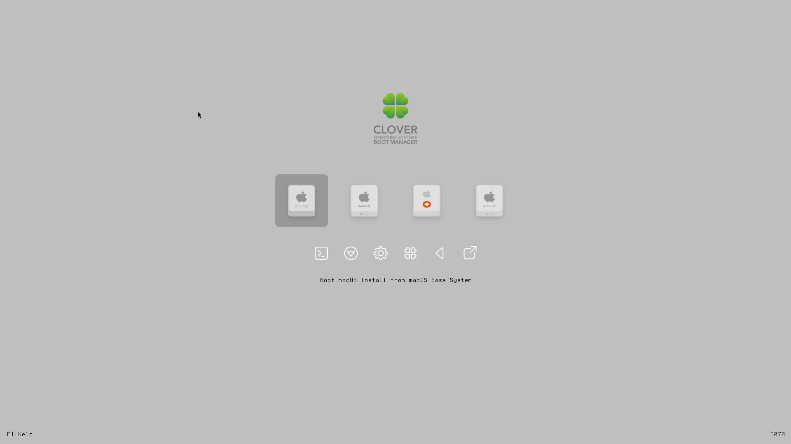
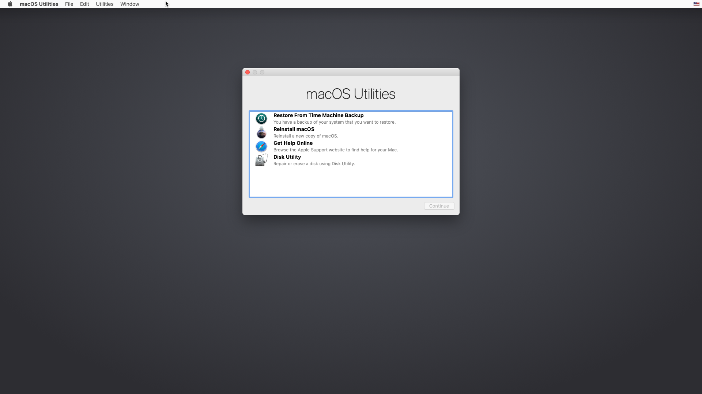
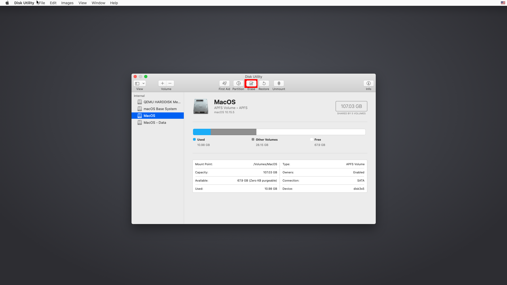
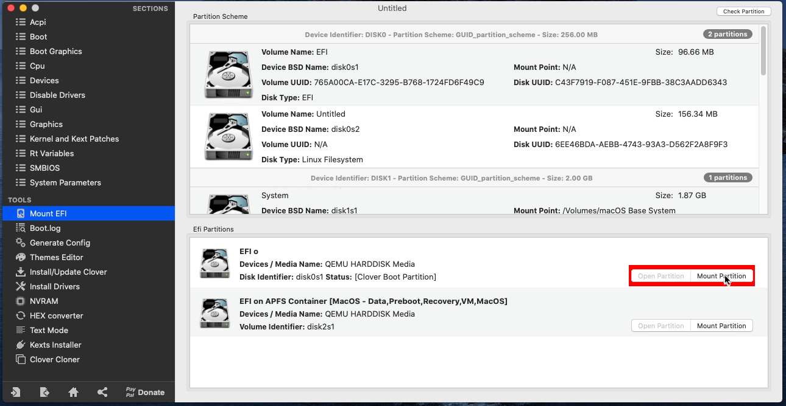
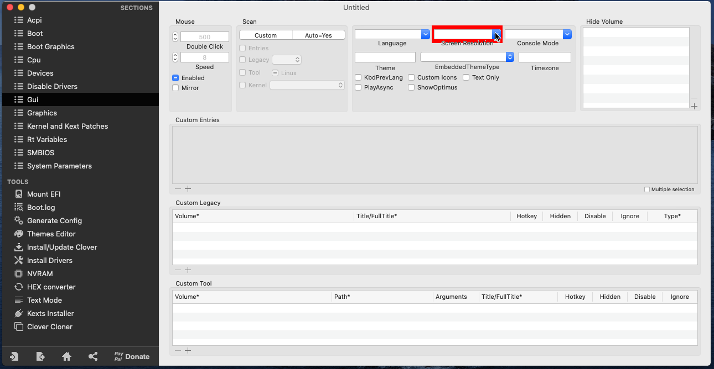
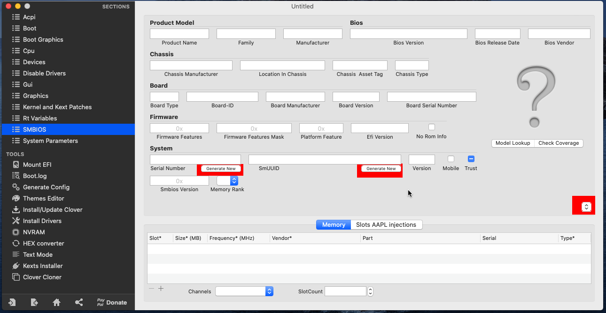
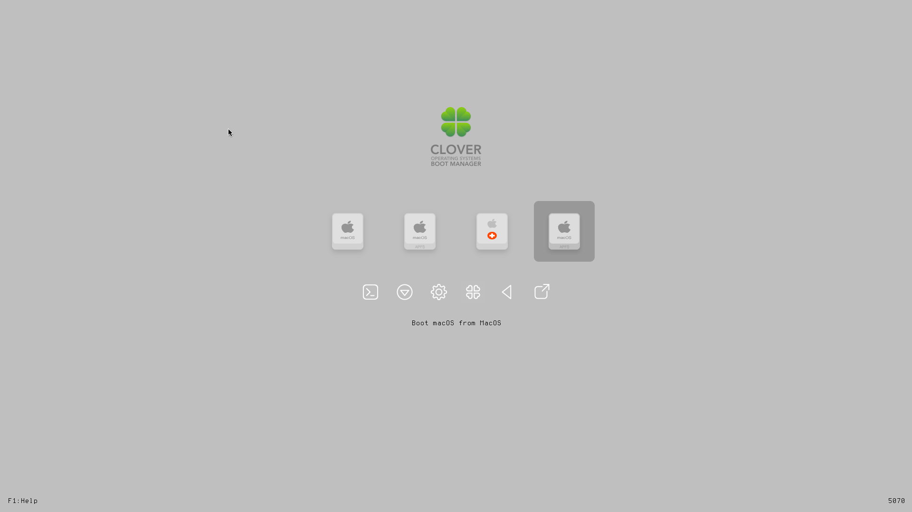

Something I stumbled accross the other day was [GitHub - foxlet/macOS-Simple-KVM: Tools to set up a quick macOS VM in QEMU, accelerated by KVM.](https://github.com/foxlet/macOS-Simple-KVM) This script makes creating a macOS VM really simple, especially for someone who does not have access to an actual Mac.  This script even enables you to install it headless to use with a server or cloud provider so that you can remotely use the VM through VNC or a similar method.  

### Resolving Dependencies

The first step is to install the necessary dependencies which will vary based on your distro.  The GitHub readme lists the dependencies for most distrobutions, which comes down to *qemu* and *python-pip*.  

I would also recommend installing *virt-manager* to add a GUI for simplification of QEMU management. You will also need to install and enable the libvirtd service for this to work.

### Getting the Virtual Machine Setup

You need to clone the repository of the script, but your disk will also live in this folder so make sure it is on a drive with probably at least 50 gigabytes of space on it.

>git clone https://github.com/foxlet/macOS-Simple-KVM.git

Then go into the folder and execute the jumpstart script:
> cd macOs-Simple-KVM && ./jumpstart.sh

This script will download the installation media and any other dependencies that the script needs.

Now you need to actually create the virtual disk for the virtual machine.

> qemu-img create -f qcow2 \<diskname>.qcow2 \<size>G

After creating that disk, you need to append it to the qemu command in basic.sh

>$EDITOR basic.sh
```
    -drive id=SystemDisk,if=none,file=<diskname>.qcow2 \
    -device ide-hd,bus=sata.4,drive=SystemDisk \
```

If you are intending to run this on a headless system, the readme also recommands adding the following options as well:
```
    -nographic
    -vnc :0 -k en-us
```

### Installing macOS on the Virtual Machine

Now just run basic.sh to start the virtual machine with the Clover bootloader
>./basic.sh


The clover bootloader should come up, and you can select the first option here to boot into the recovery utility.





First, make sure to format the drive using the disk utility so that the installer lets you use it.



Then exit back into the recovery utility and select re-install macOS and follow the prompts to install.  This will take a while and probably downloads dependencies from my experience.  One important thing is to not sign into your AppleID at all until later as it may lock your AppleID because of the serial number of the VM.  We will fix this later.

### Configuring the Virtual Machine and Enabling iMessage

#### Adding RAM

The first thing to do is to give the virtual machine more memory.  Simply edit the basic.sh script again.  Locate the line which has the *-m 2G* and edit it.

>$EDITOR basic.sh
```
    -m <amount RAM>G \
```

#### Configuring Screen Resolution

You will need to set the screen resolution unless you like to work with 1280x720.  Thankfully, this is somewhat simple.  I recommend installing Clover Configurator to simplify this process. Either way, you will need to mount the EFI partition and then edit the config.plst contained within the Clover directory.  

With Clover Configurator, simply select mount on the proper partition.



Then navigate to GUI and select the proper screen resolution from the dropdown.



Keep in mind that certain screen resolutions do not work properly, so the creator of the script recommends a normal 16:9 or 16:10 resolution.

#### Enabling iMessage

You should be done with that for now.  Next you will need to generate new serial numbers to enable iMessage and other services.  

In Clover Configurator, navigate to the RT variables section and choose "UseMacAddr0" in the ROM dropdown.  Also enter *0x28* into the BooterConfig and *0x67* into the CsrActiveConfig.

Now select SMBIOS.  On the far right there should be a small dropdown.  Select any Mac model you'd like from it; I chose a recent iMac model.

Now select Generate New a couple of times for both the Serial Number and SmUUID fields.  You can verify that your Serial Number is correct by visiting [EveryMac](https://everymac.com/ultimate-mac-lookup/) and entering your serial number.  If the correct model shows up, then you can proceed, otherwise just generate a new Serial Number.  Next, go to [Apple's website](https://checkcoverage.apple.com) and enter the Serial Number there.  The website should return you an error that the Serial Number is invalid.  This is correct as you do not want to have an actual Mac's serial number that someone owns.  If it does give a model, you need to generate a new Serial Number and repeat the process.



#### Finishing up Configuration

Save your clover config.  Clover Configurator might complain that the partition does not support file history, but you can safely ignore that.

Now shut down the VM.  Re-run basic.sh
>./basic.sh

Press escape when the VM comes up to enter the virtual machine BIOS.  Select Device Manager, then OVMF Platform Configuration, and finally Change Preferred to select the correct screen resolution that you entered earlier.  Press F10 to save the settings and then exit the VM after you exit the BIOS.

### Adding the VM to Virt-Manager

For actual use, you will probably want to add it to virt-manager.

Luckily, the script author made it very simple.  Execute this command to import it into virt-manager:

>sudo ./make.sh --add

Lastly, go into virt-manager and add the virtual disk you originally created to the virtual machine and then start and open the virtual machine.

### Finishing Up

When Clover comes up, use the arrow keys to select macOS on \<diskname>.



If everything is done correctly, simply login to your account and you can now use your macOS VM as usual.  You can login to your AppleID to use iMessage and iCloud, and it should work.

The only thing that unfortunately does not work is USB passthrough for an iOS device.  The only way to do this is to actually use PCI passthrough to pass the USB controller to the Mac VM which is quite complicated, especially if you use a laptop like me.  If you would like to attempt this, [there is a nice article on the script's GitHub repository which covers PCI passthrough.](https://github.com/foxlet/macOS-Simple-KVM/blob/master/docs/guide-passthrough.md)

You now have a fully functional macOS VM with KVM/QEMU.

### References
1) [GitHub - foxlet/macOS-Simple-KVM: Tools to set up a quick macOS VM in QEMU, accelerated by KVM.](https://github.com/foxlet/macOS-Simple-KVM)
2) [An iDiot's Guide To iMessage \| tonymacx86.com](https://www.tonymacx86.com/threads/an-idiots-guide-to-imessage.196827/)

